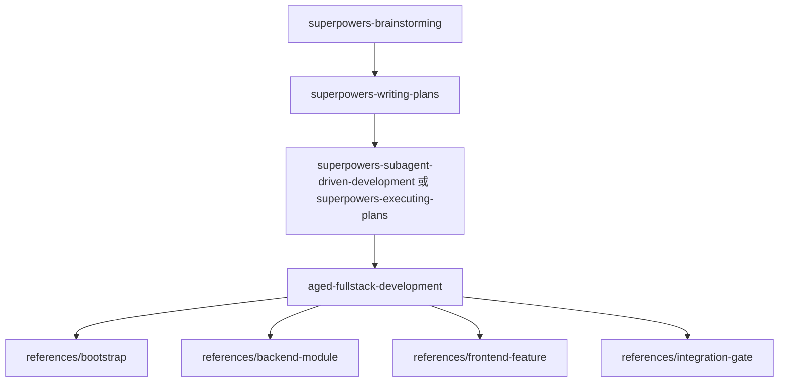

# Aged Fullstack 命令包工作流

本文档说明 `aged-fullstack` 命令包提供的 skill、适用场景，以及它与 `superpowers` 的职责边界。

## 概述

`aged-fullstack` 是 `aged-*` 项目的全栈领域包。它不接管总流程，而是默认挂在 `superpowers` 后面，负责模板起步、后端模块实现、前端功能实现，以及联调与关键校验。

它同时沉淀两类信息：

- `aged-fullstack-template` 当前已经存在的事实
- `aged-*` 项目推荐遵守的稳定规范

## 当前技能

- `aged-fullstack-development`
  - 作用：识别当前任务属于起步、后端、前端还是联调，并引导到正确的 reference
  - references：
    - `template-facts` — 模板当前事实
    - `recommended-rules` — aged 推荐规范
    - `bootstrap` — 从模板起步、初始化与自举验证
    - `backend-module` — 按 module-first 路径实现或修改 FastAPI 模块
    - `frontend-feature` — 按 service、axios、hooks、pages/components 的路径实现前端功能
    - `integration-gate` — 对齐前后端契约、错误结构与关键验证命令

## 与 superpowers 的边界

- `superpowers` 管总流程：设计、计划、执行、验证、收尾
- `aged-fullstack` 管领域规则：模板起步、接口设计、后端模块边界、前端默认路径、认证授权、安全规范、可靠性要求，以及联调与交付校验

如果需求仍在讨论，先使用 `superpowers-brainstorming`。
如果实施计划还没写，先使用 `superpowers-writing-plans`。
如果已经进入明确实现阶段，再进入 `aged-fullstack`。

## 主流程

