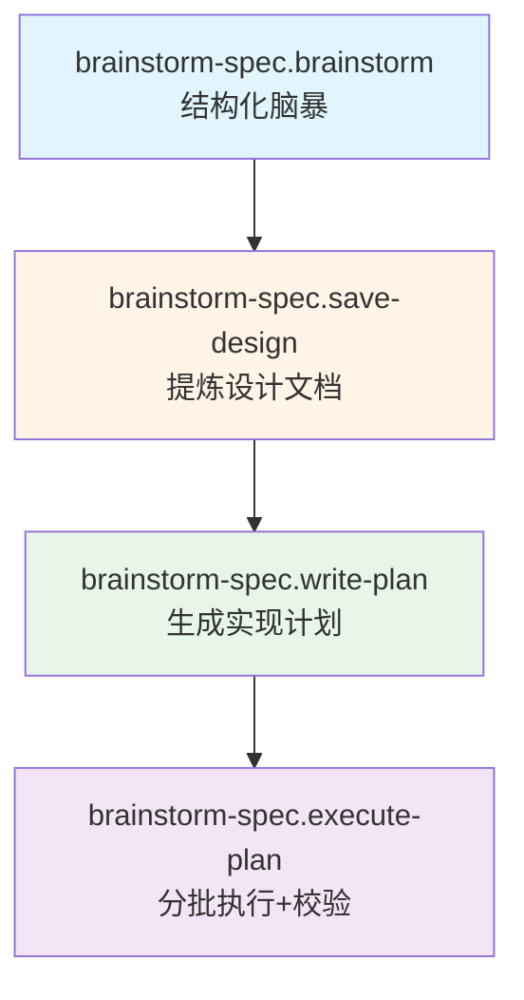
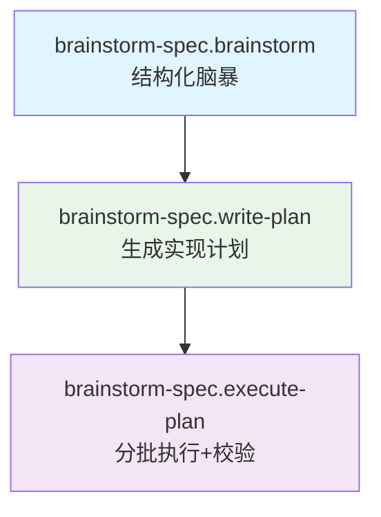

# Brainstorm-Spec 工作流

基于 [neovate-code 内置的 brainstorm spec](https://github.com/neovateai/neovate-code/blob/master/src/slash-commands/builtin/spec/brainstorm.ts)提炼

本文档说明 `brainstorm-spec` 命令包的调用顺序及作用。

## 概述

`brainstorm-spec` 覆盖从想法梳理到计划执行的全链路：

1. 结构化脑暴，锁定方案。
2. 将脑暴沉淀为设计文档（可选）。
3. 生成可执行的工程计划。
4. 按计划分批执行并回报。

### 工作流程图

完整流程

简易流程（跳过提炼设计文档）

## 命令速览

| 命令                                  | 作用                                                           | 主要产出                               |
| ------------------------------------- | -------------------------------------------------------------- | -------------------------------------- |
| `brainstorm-spec.brainstorm`          | 分三阶段梳理需求与方案，分段呈现并随时回退澄清。               | 确认的设计方向与讨论摘要（对话中产生） |
| `brainstorm-spec.save-design`（可选） | 将 `/spec:brainstorm` 后的对话提炼为设计文档并落盘。           | `docs/designs/YYYY-MM-DD-<slug>.md`    |
| `brainstorm-spec.write-plan`          | 按模板生成 Bite-size 实现计划，含文件路径、步骤与命令。        | `docs/plans/YYYY-MM-DD-<feature>.md`   |
| `brainstorm-spec.execute-plan`        | 读取计划，按批次（默认前 3 任务）执行、验证并回报 checkpoint。 | 执行进度与校验输出                     |

## 使用建议

1. 先用 `brainstorm-spec.brainstorm` 梳理需求并锁定方案。
2. 若需留存设计记录，运行 `brainstorm-spec.save-design`。
3. 使用 `brainstorm-spec.write-plan` 生成详细实施计划。
4. 按计划用 `brainstorm-spec.execute-plan` 分批实现并校验。
