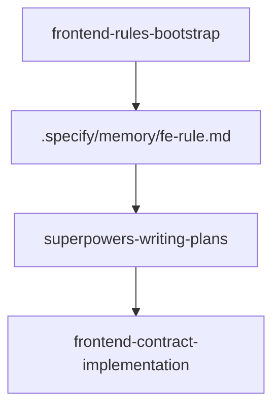

# Frontend Contract 命令包工作流

本文档说明 `frontend-contract` 命令包提供的技能及其职责边界。

## 概述

`frontend-contract` 负责沉淀“接口契约驱动前端实现”的通用能力，也就是此前 `fe-definition-gen.run` 这条逻辑拆分后的新归属地。

它解决的核心问题是：当后端接口定义已经明确时，如何基于权威契约更新前端类型、请求封装、状态处理和页面集成代码，同时仍然遵守项目的前端宪法。

## 当前技能

- `frontend-contract-implementation`
  - 作用：读取接口定义和前端宪法，完成类型、服务层、页面或组件集成代码的实现
  - 适用：接口标识、接口契约、OpenAPI 或接口文档已经存在，接下来要把它接进前端

## 与其他 package 的边界

- `frontend-rules` 管工程规则
- `frontend-contract` 管契约驱动的实现
- `superpowers` 管设计、计划和总执行流程

如果前端宪法缺失，先使用 `frontend-rules-bootstrap`。
如果需求方案还没定稿，先使用 `superpowers-writing-plans`。

## 主流程

