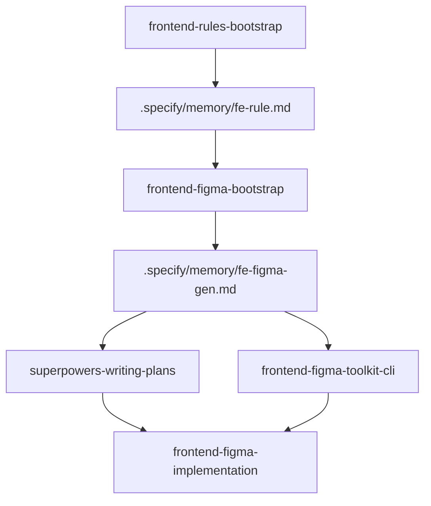

# Frontend Figma 命令包工作流

本文档说明 `frontend-figma` 命令包提供的技能及其职责边界。

## 概述

`frontend-figma` 负责沉淀跨项目可复用的 Figma 到前端代码能力，也就是此前 `fe-figma-gen.scan`、`fe-figma-gen.wizard`、`fe-figma-gen.run` 这组逻辑拆分后的新归属地。

它解决三件事：

- 建立 Figma 落地约束：扫描仓库、补齐缺口、产出 `.specify/memory/fe-figma-gen.md`
- 准备 Figma 资源：批量读取文件、节点和图片素材
- 基于设计稿实施代码：在遵守前端宪法的前提下完成页面或组件落地

## 当前技能

- `frontend-figma-bootstrap`
  - 作用：建立或更新 `.specify/memory/fe-figma-gen.md`
  - 适用：首次接手某个前端仓库的 Figma 落地工作、共享组件目录或 token 体系发生明显变化

- `frontend-figma-toolkit-cli`
  - 作用：通过 `figma-toolkit` CLI 获取 Figma 文件结构、节点详情和图片资源
  - 适用：需要批量拉素材、下载图片、核验图片真实格式、或在 MCP 之外准备资源

- `frontend-figma-implementation`
  - 作用：读取 Figma 设计稿、项目约束和前端宪法，真正完成页面或组件实现
  - 适用：设计稿节点已经明确，接下来要把它变成项目中的代码

## 与其他 package 的边界

- `frontend-rules` 管前端工程宪法
- `frontend-figma` 管设计稿落地和素材准备
- `superpowers` 管方案、实施文档和执行总流程

如果项目里还没有 `.specify/memory/fe-rule.md`，先使用 `frontend-rules-bootstrap`。
如果实施文档还没确认，先使用 `superpowers-writing-plans`。

## 主流程

