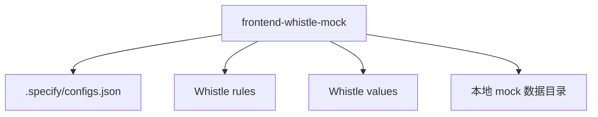

# Frontend Mocking 命令包工作流

本文档说明 `frontend-mocking` 命令包提供的技能及其职责边界。

## 概述

`frontend-mocking` 负责沉淀跨项目可复用的前端 Mock 能力。当前先以 Whistle 为主，解决“如何稳定地创建、版本化和启用本地接口 Mock”这个问题。

## 当前技能

- `frontend-whistle-mock`
  - 作用：读取或补齐本地 Whistle 配置，生成规则名、规则内容和对应的 Mock 数据，并启用规则
  - 适用：前端本地联调、接口尚未完成、需要快速复现场景或准备验收数据

## 与项目包的边界

- `frontend-mocking` 负责通用的 Whistle Mock 流程
- 项目包如果有额外目录约定、命名约定或返回结构约束，可以在项目 skill 里再包一层

## 主流程

