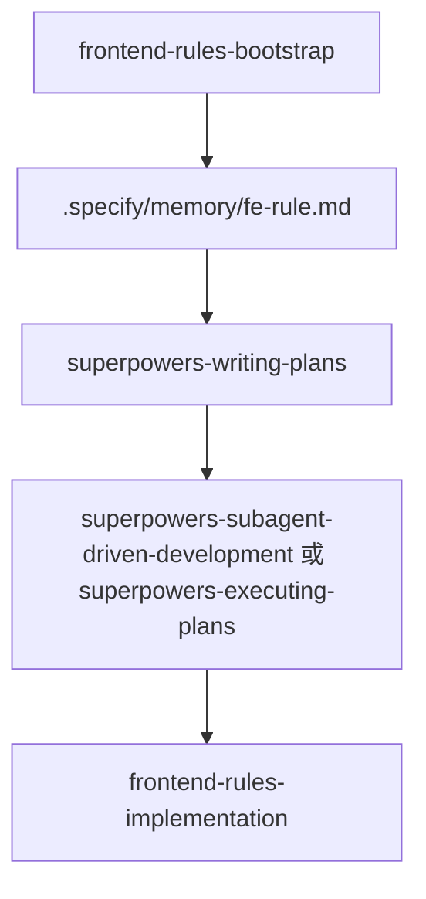

# Frontend Rules 命令包工作流

本文档说明 `frontend-rules` 命令包提供的技能及其职责边界。

## 概述

`frontend-rules` 负责沉淀跨项目可复用的前端工程规则能力，也就是此前 `fe-rule.scan`、`fe-rule.wizard`、`fe-rule.run` 这组逻辑拆分后的新归属地。

它解决两件事：

- 建立或更新前端宪法：扫描仓库、补齐缺口、产出 `.specify/memory/fe-rule.md`
- 在前端宪法约束下实施改动：读取已确认的实施文档，按现有工程方式完成代码落地

## 当前技能

- `frontend-rules-bootstrap`
  - 作用：自动扫描仓库并只对缺口做最少追问，建立或更新 `.specify/memory/fe-rule.md`
  - 适用：首次接手项目、前端技术栈升级后需要刷新规则、旧规则明显过期

- `frontend-rules-implementation`
  - 作用：读取前端宪法与已确认的实施文档，在不偏离既有工程约束的前提下完成前端实现
  - 适用：需求已明确、实施文档已写好，接下来要真正开始改代码

## 与 Superpowers 的边界

- `superpowers` 管总流程：设计、写计划、执行计划、验证、收尾
- `frontend-rules` 管前端领域规则：目录、命名、组件复用、样式体系、网络层、状态管理、测试策略

如果用户还在讨论方案，先走 `superpowers-brainstorming`。
如果实施文档还没写好，先走 `superpowers-writing-plans`。
如果实施文档已经确认，进入 `frontend-rules-implementation`。

## 主流程

