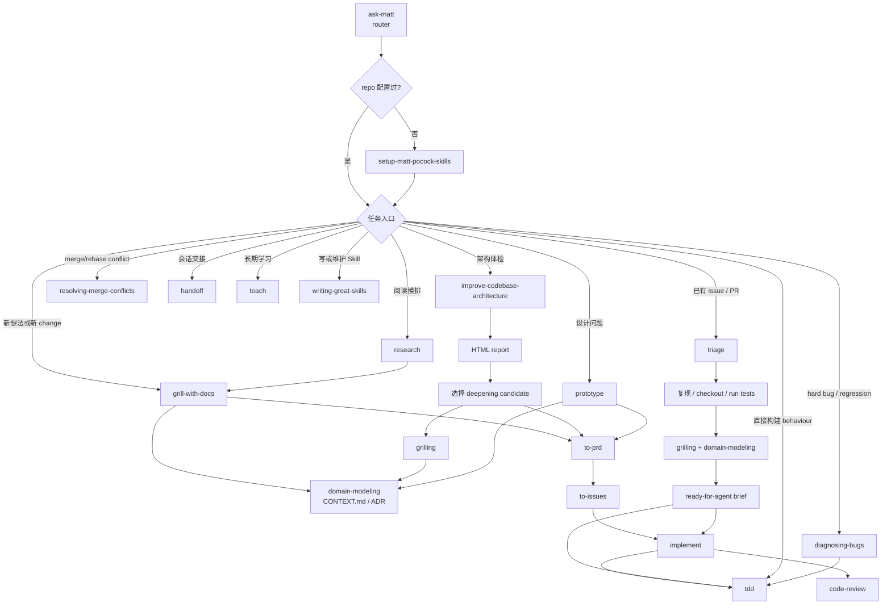

# Matt Pocock Skills 命令包工作流

本文档说明 `mattpocock-skills` 命令包的来源、技能边界、docs 结构和同步方式。

## 概述

`mattpocock-skills` 收录 Matt Pocock `skills` 仓库中与 Productivity / Engineering 工作流相关的四部分内容：

- `skills/productivity`：实际可安装、可调用的 Productivity Skill。
- `skills/engineering`：实际可安装、可调用的 Engineering Skill。
- `docs/productivity`：这些 Productivity Skill 的用户手册。
- `docs/engineering`：Engineering Skill 和主工程 flow 的用户手册。

翻译策略是保留不适合直译的英文专有名词，例如 Skill、Agent、PRD、ADR、issue、workflow、router、flow、seam、deep module、tracer bullet、red-green loop、context load、cognitive load、model-invoked、user-invoked 等；其余说明改写为自然中文。

## 当前来源

- 上游仓库：`https://github.com/mattpocock/skills`
- 上游路径：`skills/productivity`、`skills/engineering`、`docs/productivity`、`docs/engineering`
- 上游分支：`main`
- 当前上游版本：`v1.0.1-106-g66f92b6`
- 最新 tag：`v1.0.1`
- 当前来源 commit：`66f92b61f5b1434a1c7422f6fbd8efc5ee0c0214`
- 当前来源日期：`2026-07-05`

未来同步时，先运行 `git describe --tags --long --always` 获取上游版本，并对比 `_meta.json` 中的 `version` / `upstream.sourceVersion` 和上游 `main` 最新 commit。若上游内容有变化，只重新翻译变更过的文件，并更新 `version`、`upstream.describe`、`upstream.latestTag`、`upstream.commitsSinceTag`、`upstream.sourceVersion`、`upstream.sourceDate`、`syncedAt` 和必要的元数据。

## 当前技能

### Productivity Skills

- **`grill-me`**
  - **作用**：用户手动入口，启动一次 `/grilling` 会话。
  - **适用**：用户明确想被追问、被拷问方案，或想把一个模糊计划打磨清楚。

- **`grilling`**
  - **作用**：围绕计划或设计逐个追问，优先自己查代码库能回答的问题；每轮只问一个问题，并给出推荐答案。
  - **适用**：开始实现前做压力测试，确认依赖关系、边界、取舍和成功标准。

- **`handoff`**
  - **作用**：把当前对话整理成交接文档，保存到系统临时目录，并建议下一位 Agent 应调用哪些 Skill。
  - **适用**：上下文过长、准备换会话、需要让另一个 Agent 接续工作。

- **`teach`**
  - **作用**：把当前目录作为教学工作区，维护 `MISSION.md`、`RESOURCES.md`、`learning-records/`、`lessons/`、`reference/`、`assets/` 等学习状态。
  - **适用**：用户想在多个会话中学习一个技能或概念，而不是只要一次性解释。

- **`writing-great-skills`**
  - **作用**：提供 Skill 写作术语表和编辑原则，围绕调用、信息层级、引导词、删减和失败模式提高可预测性。
  - **适用**：创建、翻译、重构或审查 Skill 文档。

### Engineering Router 与 Setup

- **`ask-matt`**
  - **作用**：整套 Skill 的 router。用户描述当前处境后，它选择应该进入哪个 Skill 或 flow。
  - **适用**：不确定该走 main flow、triage lane、codebase-health lane，还是 standalone Skill。

- **`setup-matt-pocock-skills`**
  - **作用**：一次性初始化 repo 配置，包括 issue tracker、triage labels 和 domain docs 布局。
  - **适用**：每个 repo 第一次使用 `triage`、`to-prd`、`to-issues` 等 engineering Skill 前。

### Main Build Chain

- **`grill-with-docs`**
  - **作用**：以 `grilling` 打磨计划，同时把 resolved terms 写入 `CONTEXT.md`，把重大决策写成 ADR。
  - **适用**：change 还模糊，但希望在写 PRD 前同时沉淀 glossary 和决策记录。

- **`to-prd`**
  - **作用**：把已经对齐的 conversation 和 codebase 理解合成为 PRD，并发布到 issue tracker。
  - **适用**：shared understanding 已经形成，不需要重新 interview，只需要写 spec。

- **`to-issues`**
  - **作用**：把 PRD / spec 拆成按依赖排序、可独立领取的 tracer-bullet issues。
  - **适用**：PRD 已完成，需要拆给 Agent 或 human 并行执行。

- **`implement`**
  - **作用**：基于 PRD 或 issues 执行实现，内部驱动 `tdd`、typecheck、test suite、`code-review` 和 commit。
  - **适用**：spec 和 seams 已经定好，要进入实际构建。

- **`code-review`**
  - **作用**：审查 fixed point 以来的 diff，并把 Standards 与 Spec 两条轴线分开报告。
  - **适用**：main flow 末尾，或用户要求 review branch、PR、WIP changes、"review since X"。

### Triage Lane

- **`triage`**
  - **作用**：把 issue / external PR 送过 triage state machine：分类、验证、必要时 grill，并写 ready-for-agent brief。
  - **适用**：tracker 中已有原始 bug report、feature request 或 external PR，需要整理成可执行工作。

### Codebase Health Lane

- **`improve-codebase-architecture`**
  - **作用**：扫描 codebase 的 deepening opportunities，输出 HTML report，再对选中候选运行 grilling。
  - **适用**：周期性架构体检，或 codebase 已经让人频繁在多个 shallow modules 间跳转。

### Standalone / Primitive / Vocabulary

- **`tdd`**
  - **作用**：red-green loop，一次一个 behaviour，用 test-first 方式构建 feature 或修 bug。
  - **适用**：有明确 behaviour，可直接 test-first 实现。

- **`diagnosing-bugs`**
  - **作用**：先建立 tight feedback loop，再做 hypothesis、instrumentation 和 regression test。
  - **适用**：hard bug、flake、performance regression。

- **`prototype`**
  - **作用**：写 throwaway prototype 回答一个 design question。
  - **适用**：state model / logic 是否合理，或 UI 应该长什么样。

- **`research`**
  - **作用**：从 primary sources 做阅读摸排，并保存带 citation 的 Markdown。
  - **适用**：需要委派 docs/API/spec/source code 调研。

- **`resolving-merge-conflicts`**
  - **作用**：按 intent 解决进行中的 merge / rebase conflict，并完成操作。
  - **适用**：Git 已经停在 conflict 上，需要逐 hunk 解决。

- **`codebase-design`**
  - **作用**：提供 deep module 设计 vocabulary：module、interface、depth、seam、adapter、leverage、locality。
  - **适用**：设计 seam、提高 test surface 稳定性，或其他 Skill 需要 shared vocabulary。

- **`domain-modeling`**
  - **作用**：维护 ubiquitous language、`CONTEXT.md` 和 ADR。
  - **适用**：固定 domain term、处理 overloaded word、记录 hard-to-reverse decision。

## 使用建议

1. 对计划做压力测试时，优先使用 `grilling`；如果用户只记得手动入口，可以调用 `grill-me`。
2. 需要交接上下文时，用 `handoff` 生成临时目录中的交接文档，不要把敏感信息写进文档。
3. 教学类任务使用 `teach`。先确认学习使命，再写课程、参考资料和学习记录。
4. 维护本包或其他 Skill 时，使用 `writing-great-skills` 和它的 `GLOSSARY.md` 做术语与质量检查。
5. 理解 Engineering flow 时，从 `docs/engineering/ask-matt.md` 开始；它是整套 flow 的 router。
6. 只需要使用说明时读 `docs/`；需要安装到 Agent 时使用 `skills/` 下的 `SKILL.md`。
7. `codebase-design`、`domain-modeling`、`grilling` 是多个上层 flow 会调用的底层 primitive / vocabulary。不要把它们看成只给用户手动调用的入口。

## Docs 全貌

### Productivity docs

- `docs/productivity/grill-me.md`
- `docs/productivity/grilling.md`
- `docs/productivity/handoff.md`
- `docs/productivity/teach.md`
- `docs/productivity/writing-great-skills.md`

### Engineering docs

- `docs/engineering/ask-matt.md`
- `docs/engineering/code-review.md`
- `docs/engineering/codebase-design.md`
- `docs/engineering/diagnosing-bugs.md`
- `docs/engineering/domain-modeling.md`
- `docs/engineering/grill-with-docs.md`
- `docs/engineering/implement.md`
- `docs/engineering/improve-codebase-architecture.md`
- `docs/engineering/prototype.md`
- `docs/engineering/research.md`
- `docs/engineering/resolving-merge-conflicts.md`
- `docs/engineering/setup-matt-pocock-skills.md`
- `docs/engineering/tdd.md`
- `docs/engineering/to-issues.md`
- `docs/engineering/to-prd.md`
- `docs/engineering/triage.md`

## 主流程

