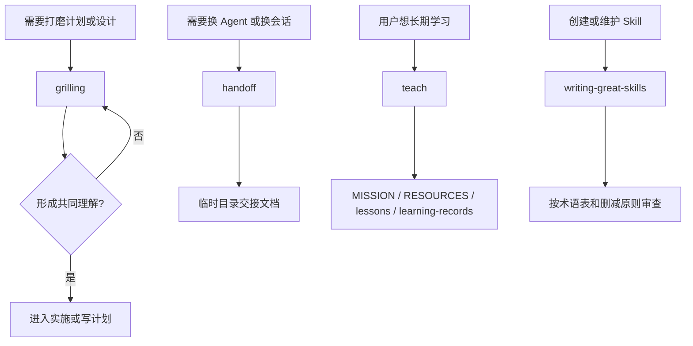

# Matt Pocock Skills 命令包工作流

本文档说明 `mattpocock-skills` 命令包的来源、技能边界和同步方式。

## 概述

`mattpocock-skills` 收录 Matt Pocock `skills/productivity` 目录下的通用效率 Skill。它们不依赖具体代码栈，主要解决三类问题：

- 在实施前用持续追问压实计划和设计。
- 在会话结束或换 Agent 前生成交接文档。
- 把当前目录变成长期教学工作区，持续沉淀学习状态。
- 作为编写 Skill 的参考资料，帮助维护者写出更可预测的 Skill。

## 当前来源

- 上游仓库：`https://github.com/mattpocock/skills`
- 上游路径：`skills/productivity`
- 上游分支：`main`
- 当前来源版本：`66f92b61f5b1434a1c7422f6fbd8efc5ee0c0214`
- 本地包版本：`1.0.0`

未来同步时，先对比 `_meta.json` 中的 `upstream.sourceVersion` 和上游 `main` 的最新 commit。若上游内容有变化，再重新翻译变更部分，并更新 `sourceVersion` 与 `syncedAt`。

## 当前技能

- **`grill-me`**
  - **作用**：用户手动入口，启动一次 `/grilling` 会话。
  - **适用**：用户明确想被追问、被拷问方案，或想把一个模糊计划打磨清楚。

- **`grilling`**
  - **作用**：围绕计划或设计逐个追问，优先自己查代码库能回答的问题；每轮只问一个问题，并给出推荐答案。
  - **适用**：开始实现前做压力测试，确认依赖关系、边界、取舍和成功标准。

- **`handoff`**
  - **作用**：把当前对话整理成交接文档，保存到系统临时目录，并建议下一位 Agent 应调用哪些 Skill。
  - **适用**：上下文过长、准备换会话、需要让另一个 Agent 接续工作。

- **`teach`**
  - **作用**：把当前目录作为教学工作区，维护 `MISSION.md`、`RESOURCES.md`、`learning-records/`、`lessons/`、`reference/`、`assets/` 等学习状态。
  - **适用**：用户想在多个会话中学习一个技能或概念，而不是只要一次性解释。

- **`writing-great-skills`**
  - **作用**：提供 Skill 写作术语表和编辑原则，围绕调用、信息层级、引导词、删减和失败模式提高可预测性。
  - **适用**：创建、翻译、重构或审查 Skill 文档。

## 使用建议

1. 对计划做压力测试时，优先使用 `grilling`；如果用户只记得手动入口，可以调用 `grill-me`。
2. 需要交接上下文时，用 `handoff` 生成临时目录中的交接文档，不要把敏感信息写进文档。
3. 教学类任务使用 `teach`。先确认学习使命，再写课程、参考资料和学习记录。
4. 维护本包或其他 Skill 时，使用 `writing-great-skills` 和它的 `GLOSSARY.md` 做术语与质量检查。

## 主流程

