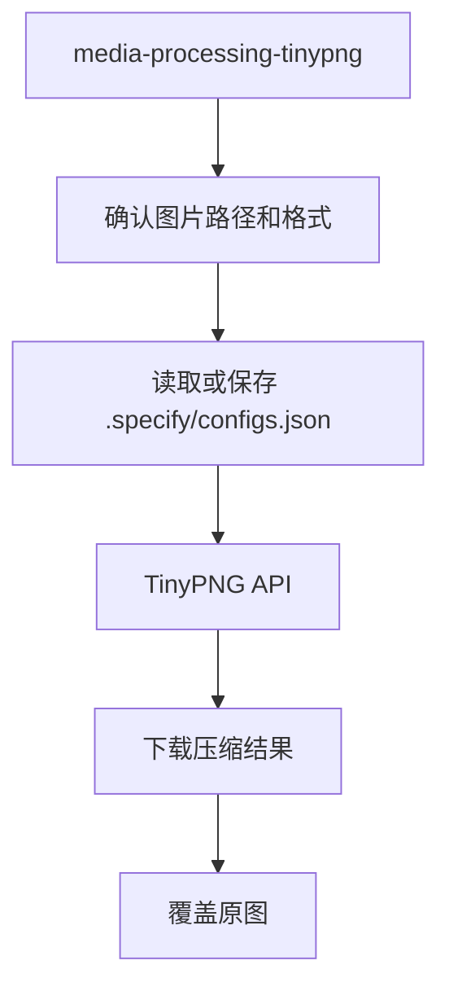

# Media Processing 命令包工作流

本文档说明 `media-processing` 命令包提供的技能及其职责边界。

## 概述

`media-processing` 负责沉淀跨项目可复用的媒体文件处理能力。当前先聚焦图片压缩，解决“在进入上传、发布或提交流程前，如何稳定压缩图片并管理 API Key”这个问题。后续如果需要扩展图片格式转换、批量裁剪、音视频转码等能力，也继续归到这个 package。

## 当前技能

- `media-processing-tinypng`
  - 作用：通过 TinyPNG API 压缩 `.png`、`.jpg`、`.jpeg`、`.webp` 图片，自动读取或保存 `tinyPNGApiKey`，并用压缩结果覆盖原图
  - 适用：素材入库前减小图片体积、Figma 素材落盘后二次压缩、提交前清理大图资源

## 与其他 package 的边界

- `media-processing` 负责通用媒体处理动作
- 项目包如果有自己的目录约定或批处理流程，可以在项目 skill 里再包一层

## 主流程

