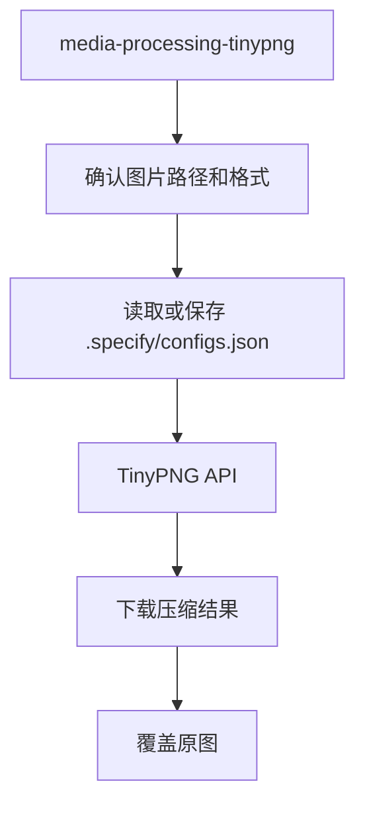

# Media Processing 命令包工作流

本文档说明 `media-processing` 命令包提供的技能及其职责边界。

## 概述

`media-processing` 负责沉淀跨项目可复用的媒体与素材处理能力：图片压缩、2D 像素风 sprite/动画表后处理，以及 2D 游戏地图策略与交付物规划。后续如需扩展格式转换、批量裁剪、音视频转码等，也可继续归到本 package。

## 当前技能

- `media-processing-tinypng`
  - 作用：通过 TinyPNG API 压缩 `.png`、`.jpg`、`.jpeg`、`.webp` 图片，自动读取或保存 `tinyPNGApiKey`，并用压缩结果覆盖原图
  - 适用：素材入库前减小体积、Figma 素材落盘后二次压缩、提交前清理大图资源

- `generate2dsprite`
  - 作用：配合 Codex 内建生图与本地 Python 脚本，完成 sprite/动画表的品红底生图、去背、切帧、对齐、QC 与透明 PNG/GIF 导出
  - 适用：角色/NPC/法术/弹道/特效等 2D 像素资产与小型 bundle

- `generate2dmap`
  - 作用：按游戏需求选择最轻量的地图策略（单张烘焙、分层 base+props、tilemap、混合），并约定碰撞、分区、props 与预览等交付物
  - 适用：需要结构化 2D 地图、碰撞与 props 编排的场景；仅在策略需要可复用透明 props 时配合 `generate2dsprite`

## 与其他 package 的边界

- `media-processing` 负责通用媒体与游戏素材处理动作
- 项目包如果有自己的目录约定或批处理流程，可以在项目 skill 里再包一层

## 主流程（图片压缩）

## Sprite 与地图（概要）

- `generate2dsprite`：由 agent 规划 sheet 与生图 prompt → 本地 `generate2dsprite.py process` 做确定性后处理与导出。
- `generate2dmap`：先定地图策略，再产出对应资产与元数据；分层/hybrid 需要透明 props 时再调用 `generate2dsprite`。
