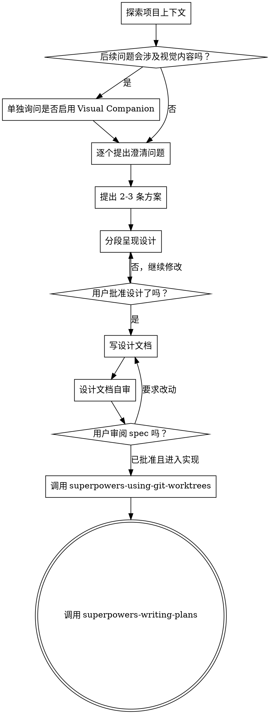

# 将想法打磨成设计规范

通过自然的协作式对话，把粗糙想法打磨成完整设计和可落地的 spec。

先理解当前项目上下文，再一次只问一个问题，逐步澄清目标、约束和成功标准。确认理解后，提出不同方案，给出推荐方案，再输出设计并获得用户确认。

<hard-gate>
在你已经展示设计并获得用户批准之前，不要调用任何实施类 skill，不要写代码，不要搭脚手架，也不要开始任何实现动作。无论项目看起来多简单，都必须先过设计闸门。
</hard-gate>

## 反模式：这事太简单，不需要设计

所有项目都要走这条流程。待办列表、小工具函数、配置调整也是如此。真正浪费时间的，往往正是那些“看起来太简单”的任务，因为它们最容易夹带未经检验的假设。设计可以很短，但不能跳过。

## 检查清单

你必须为下面每一项都建立执行心智，并按顺序完成：

1. **探索项目上下文**：查看文件、文档、最近提交。
2. **如后续问题可能涉及视觉表达，单独询问是否启用 Visual Companion**：这必须是一条独立消息，不能和澄清问题混在一起。
3. **逐个提出澄清问题**：一次一个问题，理解目标、约束和成功标准。
4. **提出 2-3 条可选方案**：说明权衡，并给出推荐。
5. **呈现设计**：按复杂度拆成若干段，每段都和用户确认。
6. **写设计文档**：保存到 `docs/superpowers/specs/YYYY-MM-DD-<topic>-design.md`。
7. **自审设计文档**：检查占位符、矛盾、歧义、范围。
8. **请用户审阅写好的 spec**：在继续前显式等待用户确认。
9. **准备隔离工作区**：如果用户确认将继续进入实现，先调用 `superpowers-using-git-worktrees`。
10. **进入实施规划**：调用 `superpowers-writing-plans`。

## 流程图

**流程的实现出口应是先 `superpowers-using-git-worktrees`，再 `superpowers-writing-plans`。** 不要在 brainstorming 后直接跳去其他实现 skill。

## 具体执行方式

**理解需求时：**
- 先查看当前项目状态：文件、文档、最近提交。
- 如果用户一上来描述的是多个彼此独立的子系统，先指出这一点，不要急着细化实现细节。
- 如果问题范围明显过大，先帮助用户拆成多个子项目，再只对第一个子项目走完整 spec 流程。
- 对于范围合适的问题，一次只问一个问题。
- 优先使用选择题，但开放式问题也可以。
- 每条消息只能有一个问题；如果某个主题要深挖，就拆成多轮。
- 重点理解：目标、约束、成功标准。

**探索方案时：**
- 至少提出 2-3 条不同路线。
- 说明每条路线的权衡。
- 先给出你的推荐方案，再解释原因。

**呈现设计时：**
- 只有在你认为自己已经理解了用户意图后，才开始输出设计。
- 每节长度按复杂度伸缩：简单问题几句话即可，复杂问题可以到 200-300 字。
- 每节结束都问一句“到这里是否正确”。
- 至少覆盖：架构、组件划分、数据流、错误处理、测试策略。
- 一旦发现前提不稳，随时退回澄清。

**为隔离与清晰而设计：**
- 把系统拆成边界清晰、职责单一的小单元。
- 每个单元都应能回答：它做什么、如何使用、依赖什么。
- 如果使用者必须读内部实现才能理解它的行为，或者内部一改就容易把调用方带崩，说明边界没设计好。
- 体量更小、职责更聚焦的文件和模块，更容易被理解、测试和修改。

**在现有代码库中工作时：**
- 先理解当前结构，再提出变化。
- 遵循已有模式。
- 如果现有代码的问题已经影响当前任务，可以把有边界的局部改善写进设计。
- 不要因为“顺手”就提出与当前目标无关的大改。

## 设计完成后

**文档：**
- 将已确认的设计写入 `docs/superpowers/specs/YYYY-MM-DD-<topic>-design.md`。
- 需要润色文案时，可用 `superpowers-writing-clearly-and-concisely`。
- 将设计文档提交到 git。

**设计文档自审：**
写完 spec 后，用新鲜视角做一次快速自检：

1. **占位符扫描**：是否还有 `TBD`、`TODO`、未完成段落或模糊要求？
2. **内部一致性**：各节之间是否自相矛盾？架构是否支撑需求描述？
3. **范围检查**：这个 spec 是否足够聚焦，可以进入单个实施计划？
4. **歧义检查**：是否有要求可以被合理地解释成两种不同实现？如果有，选一种并写死。

发现问题就原地修掉，不要把问题带入下一阶段。

**用户审阅闸门：**
自审通过后，明确告诉用户：

> “Spec 已写入 `<path>`。请先审阅这份文档；如果没有要改的地方，我再继续写实施计划。”

必须等待用户响应。若用户要求修改，就修改并重新跑一遍自审；只有在用户批准后，才能进入下一步。

**进入实现前：**
- 若用户确认接下来就要进入实现，先调用 `superpowers-using-git-worktrees` 准备隔离工作区。
- 不要在 `main` / `master` 上直接开始后续实现流程。

**进入实施规划：**
- 调用 `superpowers-writing-plans` 生成详细实施计划。
- 不要在这个阶段调用其他实现 skill。

## 关键原则

- **一次只问一个问题**
- **能用选择题就优先用选择题**
- **对范围和功能保持 YAGNI**
- **在拍板前始终给出 2-3 条方案**
- **分段验证设计，而不是一口气灌给用户**
- **发现前提不对时及时回退，不要硬推**

## Visual Companion

这是一个基于浏览器的视觉脑暴伴侣，用来展示线框图、布局、对比稿、结构图等视觉内容。它是一个工具，不是另一个模式；用户同意启用后，也不是每个问题都要走浏览器。

**何时提出启用：**
如果你预判接下来会频繁讨论视觉内容，例如界面布局、视觉风格、架构图、选项对比，就先单独发一条消息：

> “接下来有些问题如果能在浏览器里直接看图，理解会更快。我可以边聊边给你展示线框图、图示、对比稿等视觉内容。这个能力还比较新，而且会更耗 token。要不要试一下？这需要打开一个本地 URL。”

**这必须是一条独立消息。** 不要把它和澄清问题、上下文总结或其他内容混在一起。如果用户拒绝，就继续纯文本脑暴。

**每个问题重新判断是否该用浏览器：**
判断标准只有一个：**用户看图会不会比看文字更容易理解？**

- **适合浏览器**：线框图、页面布局、视觉方案对比、结构图、流程图
- **适合终端**：需求范围、概念解释、权衡分析、文字版 A/B/C 方案、澄清问题

如果用户同意启用，请在继续前阅读：
`./visual-companion.md`
