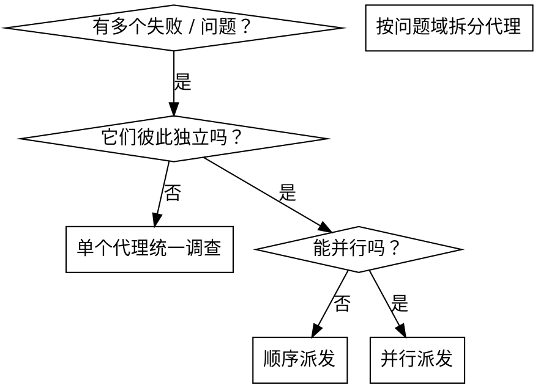

# 并行派发子代理

## 概览

当你遇到多个彼此独立的问题域时，顺序调查只会浪费时间。此时应按问题域拆开，一域一个子代理，并行推进。

**核心原则：** 每个独立问题域派一个子代理，同时工作。

## 何时使用

适用场景：
- 多个测试文件失败，但根因不相同
- 不同子系统独立出问题
- 各问题域都能在不依赖彼此结果的情况下单独理解

不适用场景：
- 这些失败可能共享同一个根因
- 需要先理解全局系统状态
- 多个代理会修改同一组文件，容易互相干扰

## 操作模式

1. **先识别独立问题域**
2. **为每个问题域写聚焦任务**
3. **并行派发**
4. **回收结果、检查冲突、统一验证**

## 好提示词的结构

每个子代理都应拿到：
- **明确范围**：只处理一个测试文件或一个子系统
- **清晰目标**：例如“让这些测试通过”
- **约束条件**：例如“不要改动其他模块”
- **输出要求**：总结根因、改动与结果

## 常见错误

**❌ 太宽泛：** “把所有测试都修了”  
**✅ 更好：** “只修 `agent-tool-abort.test.ts` 里的 3 个失败”

**❌ 没上下文：** “修 race condition”  
**✅ 更好：** 把报错、测试名和期望行为都给全

**❌ 没边界：** 子代理随便重构  
**✅ 更好：** 明确写“只修测试”或“不要改生产代码”

## 收尾

子代理返回后：
1. 阅读每份总结
2. 检查是否有写冲突
3. 运行全量验证
4. 确认这些独立修复组合后仍然成立
