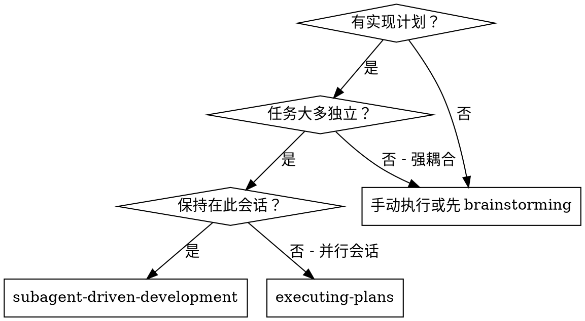
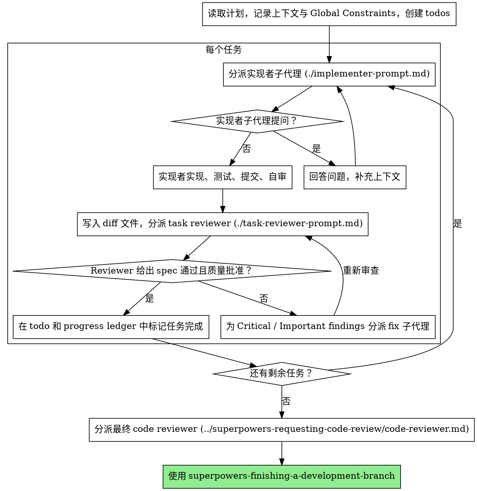

# 子代理驱动开发

通过为每个任务分派新的实现者子代理执行计划；每个任务后做一次 task review（spec compliance + code quality）；所有任务完成后，再做一次整分支 review。

**为什么用子代理：** 子代理拥有隔离上下文。你可以精确构造它们需要的输入，让它们只聚焦当前任务，而不是继承你整段会话历史。这既提高成功率，也保留主上下文用于协调和判断。

**核心原则：** 每个任务使用新的子代理 + task review（spec + quality）+ 最终整分支 review = 高质量、快速迭代。

**过程叙述：** 工具调用之间最多说一句短话。progress ledger 和工具结果负责记录细节。

**连续执行：** 不要在任务之间停下来问用户是否继续。计划要求你执行，就执行完整计划。只有三种情况可以停：出现无法自行解决的 `BLOCKED`，存在真正阻止前进的歧义，或所有任务已经完成。“要不要继续？”和阶段性长总结会浪费用户时间。

**前置要求：** 执行任何任务前，确认当前工作发生在隔离工作区中；若还没有，先调用 `superpowers-using-git-worktrees`。

## 何时使用



**相比 `superpowers-executing-plans`：**
- 同一会话，无需切换上下文
- 每个任务使用新的子代理，避免上下文污染
- 每个任务后做一次 review（spec compliance + code quality），最后做整分支 review
- 任务之间无需人工逐段介入，迭代更快

## 执行流程



## 执行前计划审查

分派任务 1 前，先快速扫描计划是否存在冲突：

- 任务之间互相矛盾，或与计划中的 `Global Constraints` 矛盾
- 计划明确要求了 review rubric 会判为缺陷的东西，例如无断言测试、整段逻辑逐字重复

把所有发现一次性提交给用户。每条都要并列展示发现和要求它的计划原文，并询问以哪边为准。不要执行到中途才逐条打断。如果扫描没有问题，直接继续。实现过程中暴露出的冲突，仍由 review loop 兜底。

## 模型选择

使用刚好能胜任角色的最轻模型，以降低成本并提升速度。

**机械型实现任务**（孤立函数、明确 spec、1-2 个文件）：使用快而便宜的模型。计划写得足够明确时，大多数实现任务都是机械型。

**集成与判断任务**（多文件协作、模式匹配、调试）：使用标准模型。

**架构与设计任务：** 使用可用范围内最强模型。最终整分支 review 属于这类任务，必须显式使用最强可用模型，而不是继承会话默认模型。

**Review 任务：** 根据 diff 的大小、复杂度和风险选择具有对应判断力的模型。小型机械 diff 不需要最强模型；微妙的并发改动需要。

**分派任何子代理时都要显式指定模型。** 省略模型会继承当前会话模型，通常也是最强、最贵的模型，悄悄抵消本节的目的。

**轮数比单 token 价格更重要。** 墙钟时间和上下文成本会随子代理轮数增长。最便宜的模型在多步任务上常常需要 2-3 倍轮数，反而更贵。Reviewer 和从自然语言描述实现的 implementer，使用中档模型作为下限。如果任务文本包含完整待写代码，实现就是转写加测试，可以用最低档模型。单文件机械修复也可用最低档模型。

**实现任务复杂度信号：**
- 只改 1-2 个文件且 spec 完整：低成本模型
- 涉及多文件和集成顾虑：标准模型
- 需要设计判断或广泛理解代码库：最强可用模型

## 处理实现者状态

实现者子代理会返回四种状态，必须分别处理：

**DONE：** 生成 review package：在本 skill 目录运行 `scripts/review-package BASE HEAD`。它会打印写入的唯一文件路径。`BASE` 必须是分派实现者前记录的提交，不要用 `HEAD~1`，否则多提交任务只会审最后一个提交。随后把打印出的路径交给 task reviewer。

**DONE_WITH_CONCERNS：** 实现者完成了工作，但标记了疑虑。先读清楚疑虑。如果涉及正确性或范围，先处理再进入 review；如果只是观察项，例如“这个文件变大了”，记录后继续 review。

**NEEDS_CONTEXT：** 实现者缺少必要上下文。补充缺失信息后重新分派。

**BLOCKED：** 实现者无法完成任务。判断阻塞类型：
1. 如果是上下文问题，补上下文后用同一模型重新分派
2. 如果任务需要更强推理，换更强模型重新分派
3. 如果任务太大，拆小
4. 如果计划本身有问题，升级给用户

**绝不要**忽视升级信号，也不要在没有变化的情况下让同一模型盲试。实现者说卡住，说明需要改变输入、模型或任务边界。

## 处理 Reviewer 的 ⚠️ 项

Task reviewer 可能报告 “⚠️ Cannot verify from diff” 项，即要求存在于未改代码或跨任务上下文中。它们不阻塞其他 review 判断，但在标记任务完成前，你必须亲自解决：你掌握计划和跨任务上下文，而 reviewer 没有。如果确认该项是真缺口，就按 spec review 失败处理，交回实现者并重新 review。

## 构造 Reviewer Prompt

每个任务的 review 是任务级 gate。最终整分支 review 只在所有任务完成后执行一次。填写 reviewer 模板时：

- 不要加入“检查所有调用点”“必要时跑 race tests”这类开放式指令，除非有具体、任务相关的理由
- 不要要求 reviewer 重新运行实现者已经在同一代码上跑过的测试；实现者报告提供测试证据
- 不要替 reviewer 预判 finding。不要让 reviewer 忽略或不要标记某个问题。如果你认为某个 finding 可能是假阳性，让 reviewer 提出来，再在 review loop 中判断。prompt 中出现 “do not flag”“don't treat X as a defect”“at most Minor”“the plan chose” 时，立刻停下；这通常是在为了省一轮 review 而预判
- 交给 reviewer 的 `Global Constraints` 是注意力镜头。把计划或 spec 中的约束逐字复制进去：精确值、精确格式，以及组件之间的关系（例如 “same layout as X”“matches Y”）。Reviewer 模板本身已经包含流程规则，例如 YAGNI、测试卫生、review 方法；constraints 只写本项目 spec 要求
- 把 diff 作为文件交给 reviewer：运行 `scripts/review-package BASE HEAD`，把打印路径传给 reviewer。没有 bash 时，把 `git log --oneline`、`git diff --stat`、`git diff -U10` 的 range 输出重定向到一个唯一文件。diff 不进入主上下文；reviewer 通过一次读取获得 commit list、stat 和带上下文的完整 diff。`BASE` 使用分派实现者前记录的提交，绝不用 `HEAD~1`
- 子代理 prompt 描述一个任务，不描述整段会话历史。不要把之前任务的累计总结粘贴进后续 dispatch。新子代理只需要自己的任务、相关接口和全局约束
- 对 Critical 和 Important findings 分派 fix 子代理。Minor findings 写入 progress ledger，并在最终整分支 review 时指向这份列表，让它判断合并前是否必须处理
- 标为 plan-mandated 的 finding，或任何与计划文本冲突的 finding，都交给用户决定。展示 finding 与计划原文，询问以哪边为准。不要因为计划要求就压掉 finding，也不要在未询问时分派一个违反计划的修复
- 最终整分支 review 也需要 package：运行 `scripts/review-package MERGE_BASE HEAD`（`MERGE_BASE` 是分支起点，例如 `git merge-base main HEAD`），把打印路径交给最终 reviewer
- 每个 fix dispatch 都带实现者契约：fix 子代理要重新运行覆盖改动的测试并报告结果。dispatch 中命名对应测试文件。重新分派 reviewer 前，确认 fix report 包含覆盖测试、命令和输出
- 如果最终整分支 review 返回 findings，分派一个 fix 子代理处理完整 findings 列表。不要每个 finding 派一个 fixer；那会重复构建上下文并重复跑测试

## 文件交接

凡是粘贴进 dispatch prompt 的内容，以及子代理打印回来的内容，都会留在主上下文里，被后续每轮重新读取。大块产物用文件交接：

- **Task brief：** 分派 implementer 前运行 `scripts/task-brief PLAN_FILE N`。它会把任务全文提取到唯一文件，并打印路径。Dispatch 中让 brief 成为需求的唯一来源。Dispatch 应包含：(1) 该任务在项目中的位置；(2) brief 路径，并说明“先读这个，它是你的需求，精确值要逐字使用”；(3) 之前任务产生的接口与决策；(4) 你已解决的 brief 歧义；(5) report 文件路径与报告契约。精确值、magic strings、签名、测试用例只出现在 brief 中。
- **Report file：** 按 brief 命名实现者报告文件（如 `task-N-brief.md` → `task-N-report.md`），并写进 dispatch。实现者把完整报告写到文件里，最终消息只返回 status、commits、一行测试摘要和 concerns。
- **Reviewer inputs：** task reviewer 拿到三个路径：同一个 brief 文件、report 文件、review package；再加上约束该任务的 `Global Constraints`。
- Fix dispatch 把修复报告（含测试结果）追加到同一个 report 文件，并返回短摘要；re-review 读取更新后的 report。

## 持久进度

对话记忆无法保证在压缩后保留。真实会话中，controller 丢失上下文后曾重新分派整段已完成任务，这是最高成本的失败之一。用 ledger 文件跟踪进度，不只依赖 todos。

- skill 开始时检查 ledger：`cat "$(git rev-parse --show-toplevel)/.superpowers/sdd/progress.md"`。其中标记为 complete 的任务就是 DONE，不要重新分派；从第一个未完成任务恢复
- 任务 review 干净后，在同一轮 bookkeeping 中向 ledger 追加一行：`Task N: complete (commits <base7>..<head7>, review clean)`
- ledger 是恢复地图。它命名的 commits 存在于 git 中，即使上下文不记得。压缩后，信任 ledger 和 `git log`，不要信任记忆
- `git clean -fdx` 会删除 ledger，因为它是 git-ignored scratch；如果发生，用 `git log` 恢复

## 提示模板

- [implementer-prompt.md](implementer-prompt.md) - 分派实现者子代理
- [task-reviewer-prompt.md](task-reviewer-prompt.md) - 分派 task reviewer（spec compliance + code quality）
- 最终整分支 review：使用 `superpowers-requesting-code-review` 的 [code-reviewer.md](../superpowers-requesting-code-review/code-reviewer.md)

## 示例工作流

```text
你：我将使用 Subagent-Driven Development 执行这个计划。

[读取计划文件一次：docs/superpowers/plans/feature-plan.md]
[为所有任务创建 todos]

任务 1：hook 安装脚本

[为任务 1 运行 task-brief；用 brief、report 路径和上下文分派 implementer]

Implementer：“开始前有个问题：hook 应安装在用户级还是系统级？”

你：“用户级（~/.config/superpowers/hooks/）。”

Implementer：“明白，现在实现。”
[稍后] Implementer：
  - 实现 install-hook 命令
  - 添加测试，5/5 passing
  - 自审：发现遗漏 --force flag，已补上
  - 已提交

[运行 review-package，用打印路径分派 task reviewer]
Task reviewer：Spec ✅ - 所有要求满足，没有额外内容。
  Strengths: 测试覆盖良好，代码清晰。Issues: 无。Task quality: Approved.

[标记任务 1 完成]

任务 2：恢复模式

[为任务 2 运行 task-brief；用 brief、report 路径和上下文分派 implementer]

Implementer：[没有问题，继续]
Implementer：
  - 添加 verify / repair 模式
  - 8/8 tests passing
  - 自审：无问题
  - 已提交

[运行 review-package，用打印路径分派 task reviewer]
Task reviewer：Spec ❌:
  - Missing: progress reporting（spec 要求 “每 100 项报告一次”）
  - Extra: 添加了未请求的 --json flag
  Issues (Important): magic number (100)

[带所有 findings 分派 fix 子代理]
Fixer：移除 --json flag，添加 progress reporting，抽出 PROGRESS_INTERVAL constant

[Task reviewer 重新审查]
Task reviewer：Spec ✅。Task quality: Approved.

[标记任务 2 完成]

...

[所有任务完成后]
[分派最终 code-reviewer]
Final reviewer：所有要求满足，可以合并
```

## 优势

**相比手动执行：**
- 子代理更自然地遵循 TDD
- 每个任务使用新上下文，减少混淆
- 并行安全，子代理之间不互相干扰
- 子代理可以在开始前和过程中提问

**相比 `superpowers-executing-plans`：**
- 同一会话，无需交接
- 持续推进，不等待人工确认
- 自动设置 review 检查点

**效率收益：**
- Controller 精确整理上下文；大块产物通过文件交接，不粘贴进主上下文
- 子代理一开始就拿到完整信息
- 问题在开工前暴露，而不是做完后才发现

**质量关口：**
- 自审在交接前拦截问题
- Task review 同时给出两个 verdict：spec compliance 和 code quality
- Review loop 确保修复真的完成
- Spec compliance 防止少做或多做
- Code quality 确保实现质量达标

**成本：**
- 子代理调用更多（每任务 implementer + reviewer）
- Controller 前期准备更多，例如提取任务和准备文件
- Review loop 会增加轮次
- 但越早发现问题，通常越便宜

## 红旗

**绝不要：**
- 未经用户明确同意，就在 `main` / `master` 分支上开始实现
- 跳过 task review，或接受缺少任一 verdict 的报告；spec compliance 和 task quality 都必须出现
- 带着未修复问题继续推进
- 并行分派多个会互相冲突的实现者子代理
- 让子代理读取整份计划文件；应给它 `scripts/task-brief` 生成的 task brief
- 跳过场景上下文，让子代理不知道任务在整体中的位置
- 忽视子代理问题
- 在 spec compliance 上接受 “差不多”；reviewer 发现 spec 问题就不是 done
- 跳过 review loop；reviewer 发现问题后，必须修复并重新 review
- 用实现者自审替代真正 review；两者都需要
- 在 dispatch prompt 中告诉 reviewer 什么不要标记，或预设 finding 严重性，例如 “at most Minor”
- 未生成 diff 文件就分派 task reviewer；先运行 `scripts/review-package BASE HEAD`，并在 prompt 中写入打印路径
- Review 还有开放 Critical / Important issues 时进入下一个任务
- 重新分派 ledger 已标记 complete 的任务；压缩或恢复后先查 ledger 和 `git log`

**如果子代理提问：**
- 清楚完整地回答
- 必要时提供更多上下文
- 不要催它猜着实现

**如果 reviewer 发现问题：**
- 实现者或 fix 子代理修复
- Reviewer 重新审查
- 重复直到 approved
- 不要跳过 re-review

**如果子代理失败：**
- 带具体指令分派 fix 子代理
- 不要手动修复，避免污染主上下文

## 集成

**必需的工作流技能：**
- `superpowers-using-git-worktrees` - 确保隔离工作区存在，创建或验证已有工作区
- `superpowers-writing-plans` - 创建本 skill 执行的计划
- `superpowers-requesting-code-review` - 最终整分支 review 的模板
- `superpowers-finishing-a-development-branch` - 所有任务完成后收尾

**子代理应使用：**
- `superpowers-test-driven-development` - 每个任务按 TDD 执行

**替代工作流：**
- `superpowers-executing-plans` - 用于无法在同一会话使用子代理时的线性执行
