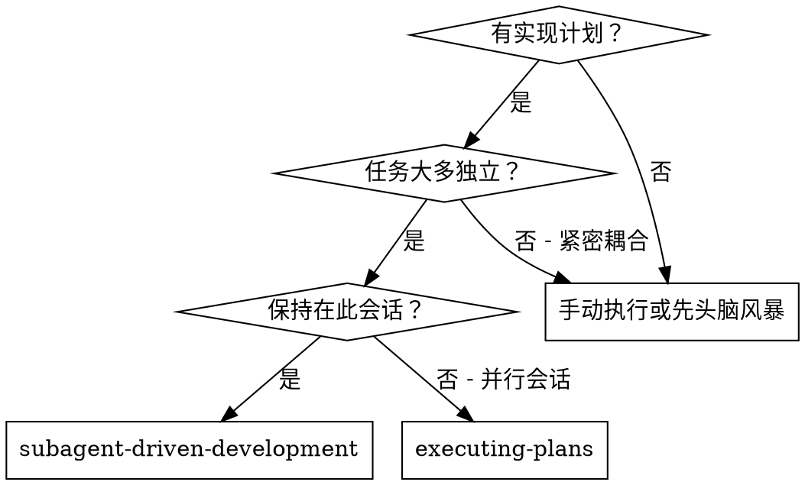
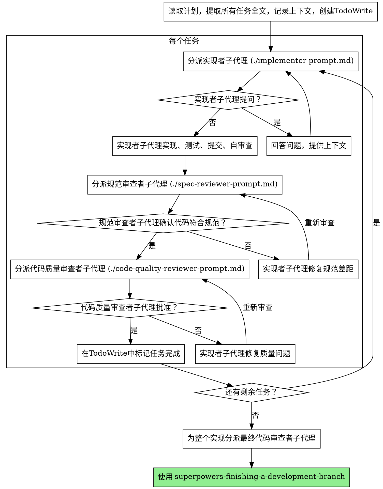

# 子代理驱动开发

通过为每个任务分派新的子代理执行计划，每个任务后进行两阶段审查：首先是规范合规性审查，然后是代码质量审查。

**核心原则：** 每个任务使用新的子代理 + 两阶段审查（规范然后质量）= 高质量、快速迭代

## 何时使用



**相比执行计划（并行会话）：**
- 同一会话（无上下文切换）
- 每个任务使用新的子代理（无上下文污染）
- 每个任务后进行两阶段审查：首先是规范合规性，然后是代码质量
- 更快的迭代（任务之间无需人工介入）

## 执行流程



## 提示模板

- `./implementer-prompt.md` - 分派实现者子代理
- `./spec-reviewer-prompt.md` - 分派规范合规性审查者子代理
- `./code-quality-reviewer-prompt.md` - 分派代码质量审查者子代理

## 示例工作流

```
您：我将使用子代理驱动开发执行这个计划。

[读取计划文件一次：docs/plans/feature-plan.md]
[提取所有5个任务的全文和上下文]
[创建包含所有任务的TodoWrite]

任务1：钩子安装脚本

[获取任务1文本和上下文（已提取）]
[分派实现者子代理，提供完整任务文本 + 上下文]

实现者："开始之前 - 钩子应该在用户级别还是系统级别安装？"

您："用户级别 (~/.config/superpowers/hooks/)"

实现者："明白了。现在开始实现..."
[稍后] 实现者：
  - 实现了 install-hook 命令
  - 添加了测试，5/5通过
  - 自审查：发现我错过了 --force 标志，已添加
  - 已提交

[分派规范合规性审查者]
规范审查者：✅ 符合规范 - 满足所有要求，没有多余内容

[获取 git SHA，分派代码质量审查者]
代码审查者：优点：测试覆盖良好，代码清晰。问题：无。已批准。

[标记任务1完成]

任务2：恢复模式

[获取任务2文本和上下文（已提取）]
[分派实现者子代理，提供完整任务文本 + 上下文]

实现者：[无问题，继续执行]
实现者：
  - 添加了 verify/repair 模式
  - 8/8测试通过
  - 自审查：一切良好
  - 已提交

[分派规范合规性审查者]
规范审查者：❌ 问题：
  - 缺少：进度报告（规范说"每100个项目报告一次"）
  - 多余：添加了 --json 标志（未请求）

[实现者修复问题]
实现者：移除了 --json 标志，添加了进度报告

[规范审查者再次审查]
规范审查者：✅ 现在符合规范

[分派代码质量审查者]
代码审查者：优点：扎实。问题（重要）：魔法数字（100）

[实现者修复]
实现者：提取了 PROGRESS_INTERVAL 常量

[代码审查者再次审查]
代码审查者：✅ 已批准

[标记任务2完成]

...

[所有任务完成后]
[分派最终代码审查者]
最终审查者：满足所有要求，准备合并

完成！
```

## 优势

**相比手动执行：**
- 子代理自然遵循 TDD
- 每个任务都有新的上下文（无混淆）
- 并行安全（子代理不会相互干扰）
- 子代理可以提问（工作前和工作中都可以）

**相比执行计划：**
- 同一会话（无交接）
- 持续进展（无需等待）
- 审查检查点自动进行

**效率提升：**
- 无文件读取开销（控制器提供完整文本）
- 控制器精确策划所需上下文
- 子代理预先获得完整信息
- 问题在工作开始前就浮现（而非之后）

**质量关卡：**
- 自审查在交接前发现问题
- 两阶段审查：规范合规性，然后是代码质量
- 审查循环确保修复真正有效
- 规范合规性防止过度/不足构建
- 代码质量确保实现构建良好

**成本：**
- 更多的子代理调用（每个任务需要实现者 + 2 个审查者）
- 控制器需要做更多准备工作（预先提取所有任务）
- 审查循环增加了迭代次数
- 但能及早发现问题（比后续调试更便宜）

## 危险信号

**永远不要：**
- 跳过审查（规范合规性或代码质量）
- 在问题未修复的情况下继续
- 并行分派多个实现者子代理（会导致冲突）
- 让子代理读取计划文件（应提供完整文本）
- 跳过场景设置上下文（子代理需要理解任务适合的位置）
- 忽略子代理的问题（在让他们继续之前回答）
- 在规范合规性上接受"差不多"（规范审查者发现问题 = 未完成）
- 跳过审查循环（审查者发现问题 = 实现者修复 = 再次审查）
- 让实现者自审查替代实际审查（两者都需要）
- **在规范合规性为✅之前开始代码质量审查**（错误顺序）
- 在任一审查有开放问题时移动到下一个任务

**如果子代理提问：**
- 清晰完整地回答
- 如需要，提供额外上下文
- 不要催促他们进入实现

**如果审查者发现问题：**
- 实现者（同一子代理）修复问题
- 审查者再次审查
- 重复直到批准
- 不要跳过重新审查

**如果子代理任务失败：**
- 用具体指令分派修复子代理
- 不要尝试手动修复（避免上下文污染）

## 集成

**必需的工作流技能：**
- **`skills/superpowers-writing-plans`** - 创建此技能执行的计划
- **`skills/superpowers-requesting-code-review`** - 审查者子代理的代码审查模板
- **`skills/superpowers-finishing-a-development-branch`** - 完成所有任务后的开发

**子代理应该使用：**
- **`skills/superpowers-test-driven-development`** - 子代理为每个任务遵循 TDD

**替代工作流：**
- **`skills/superpowers-executing-plans`** - 用于并行会话而非同一会话执行