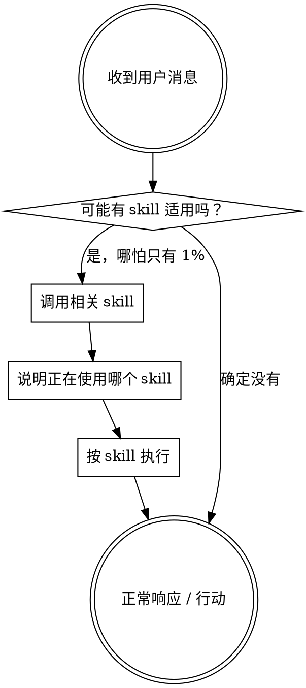

<SUBAGENT-STOP>
如果你是被派发出来执行某个具体任务的子代理，请跳过这个 skill。
</SUBAGENT-STOP>

<extremely-important>
如果你觉得某个 skill 有哪怕 1% 的可能适用于当前任务，你都必须调用它。

如果有适用的 skill，你没有选择权，必须使用。
</extremely-important>

## 指令优先级

superpowers skills 会覆盖默认系统提示中的一部分行为，但**用户指令始终优先**：

1. **用户明确指令**（如 AGENTS.md、直接要求）
2. **Superpowers skills**
3. **默认系统提示**

如果用户明确说“不要用 TDD”，而 skill 说“始终用 TDD”，以用户要求为准。

## 如何访问技能

不同平台加载 skill 的方式不同：

- **Claude Code**：用 `Skill` 工具
- **Gemini CLI**：用 `activate_skill`
- **Codex / 其他环境**：按平台文档或当前运行环境的原生机制处理

如果平台原生已经把 skill 放进上下文，就直接遵守其内容。

## 平台适配

upstream 文档以 Claude Code 工具名为基准。若当前不是 Claude Code：

- Codex：参考 `references/codex-tools.md`
- Gemini CLI：参考 `references/gemini-tools.md`

# 使用规则

## 铁律

**在做出任何响应或动作之前，先判断并调用相关 skill。**

哪怕只是澄清问题，只要 skill 有可能适用，也应先检查 skill。

## 这些想法都说明你在自我合理化

| 想法 | 现实 |
| --- | --- |
| “这只是个简单问题” | 简单问题也是任务，也可能对应 skill |
| “我先看几眼代码再说” | skill 会决定你该怎么探索 |
| “我记得这个 skill 的内容” | skill 会演进，当前版本才算数 |
| “先做一步应该没事” | skill 判断必须先于动作 |
| “这个 skill 有点大材小用” | 小任务更容易因为跳流程而浪费时间 |

## skill 优先级

当多个 skill 同时可能适用时，按这个顺序：

1. **流程型 skill**：决定怎么做，比如 brainstorming、systematic-debugging
2. **执行型 skill**：指导具体落地，比如 writing-plans、subagent-driven-development

示例：
- “我们来做个新功能” → 先 `superpowers-brainstorming`
- “帮我修个 bug” → 先 `superpowers-systematic-debugging`
- “spec 已确认，准备进入实现” → 先 `superpowers-using-git-worktrees`，再进入 `superpowers-writing-plans`

## 用户指令决定做什么，skill 决定怎么做

用户说“加功能 X”或“修 bug Y”，不等于可以跳过工作流。  
用户明确要求改变工作流时，才覆盖 skill 默认行为。
