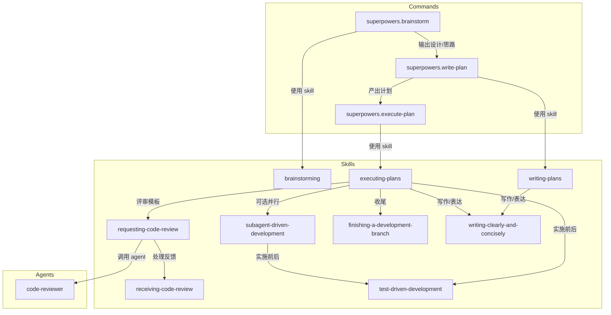
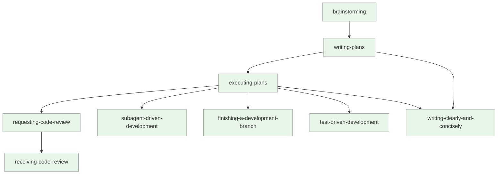
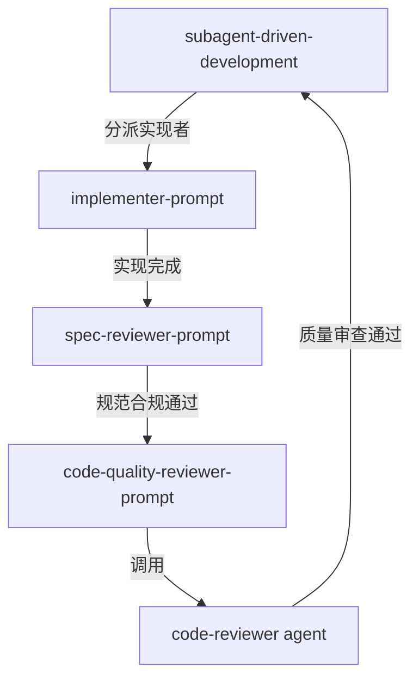

# Superpowers 工作流

基于 [superpowers](https://github.com/obra/superpowers)提炼出了核心的主 commands、skill 和 agent。

本文档说明 `superpowers` 命令包的命令、skills、agents 及其调用关系。

## 概述

`superpowers` 提供一组通用工作流组件：
- 命令：brainstorm / write-plan / execute-plan，覆盖从脑暴到计划执行的链路。
- skills：支撑执行的能力模块（brainstorming、writing-plans、executing-plans、receiving/requesting-code-review、subagent-driven-development、finishing-a-development-branch、test-driven-development、writing-clearly-and-concisely）及其相关模板文件。
- agents：code-reviewer，用于代码审查。

## 调用关系图

### 命令流程图

### Skills 触发关系

### 评审 Agent 链路

### Subagent 驱动开发链路

## 命令速览

| 命令                       | 作用                                               | 主要产出                             |
| -------------------------- | -------------------------------------------------- | ------------------------------------ |
| `superpowers.brainstorm`   | 按脑暴 skill 结构化提问，收敛方案。                | 对话中的设计方向与摘要               |
| `superpowers.write-plan`   | 基于确定的思路生成可执行计划（路径、步骤、命令）。 | `docs/plans/YYYY-MM-DD-<feature>.md` |
| `superpowers.execute-plan` | 读取计划，分批执行并校验 checkpoint。              | 执行进度与校验输出                   |

## Skills 速览（核心职责）

### 核心 Skills
- `brainstorming`：结构化脑暴、提问、收敛方案。
- `writing-plans`：生成颗粒化实施计划（精确路径、示例、验证步骤）。
- `executing-plans`：分批执行计划并在批次间汇报。
- `requesting-code-review` + `code-reviewer` agent + `receiving-code-review`：发起与接收代码评审。
- `subagent-driven-development`：同会话内任务级并行执行（每任务新 subagent，任务间 code review）。
- `finishing-a-development-branch`：收尾开发分支，提供合并/PR/保留/丢弃选项并清理。
- `test-driven-development`：先失败测试再实现，若项目无测试则声明跳过。
- `writing-clearly-and-concisely`：中文写作清晰简练，主动、具体、删繁。

### 模板文件（Templates）
- `requesting-code-review/code-reviewer.md`：code-reviewer subagent 请求评审时使用的模板。
- `subagent-driven-development/implementer-prompt.md`：实现者子代理提示模板，用于分派实现者子代理。
- `subagent-driven-development/spec-reviewer-prompt.md`：规范合规性审查者提示模板，用于分派规范合规性审查者子代理。
- `subagent-driven-development/code-quality-reviewer-prompt.md`：代码质量审查者提示模板，用于分派代码质量审查者子代理。
- `test-driven-development/testing-anti-patterns.md`：测试反模式参考文档，帮助避免常见的测试错误。

## 使用建议

1) 先用 `superpowers.brainstorm` 收敛方案；必要时结合 `brainstorming` skill。  
2) 运行 `superpowers.write-plan` 生成计划，依据 `writing-plans` / `writing-clearly-and-concisely` 优化表述。  
3) 用 `superpowers.execute-plan` 按批次执行，执行过程中：  
   - 按需触发 `requesting-code-review` + `code-reviewer` + `receiving-code-review`（使用 `code-reviewer.md` 模板）。  
   - 需要并行/同会话执行时用 `subagent-driven-development`（使用 `implementer-prompt.md`、`spec-reviewer-prompt.md`、`code-quality-reviewer-prompt.md` 模板）。  
   - 收尾前调用 `finishing-a-development-branch`。  
   - 确保按 `test-driven-development` 原则执行（参考 `testing-anti-patterns.md` 避免常见错误；如缺少测试框架，先声明无法执行 TDD）。
