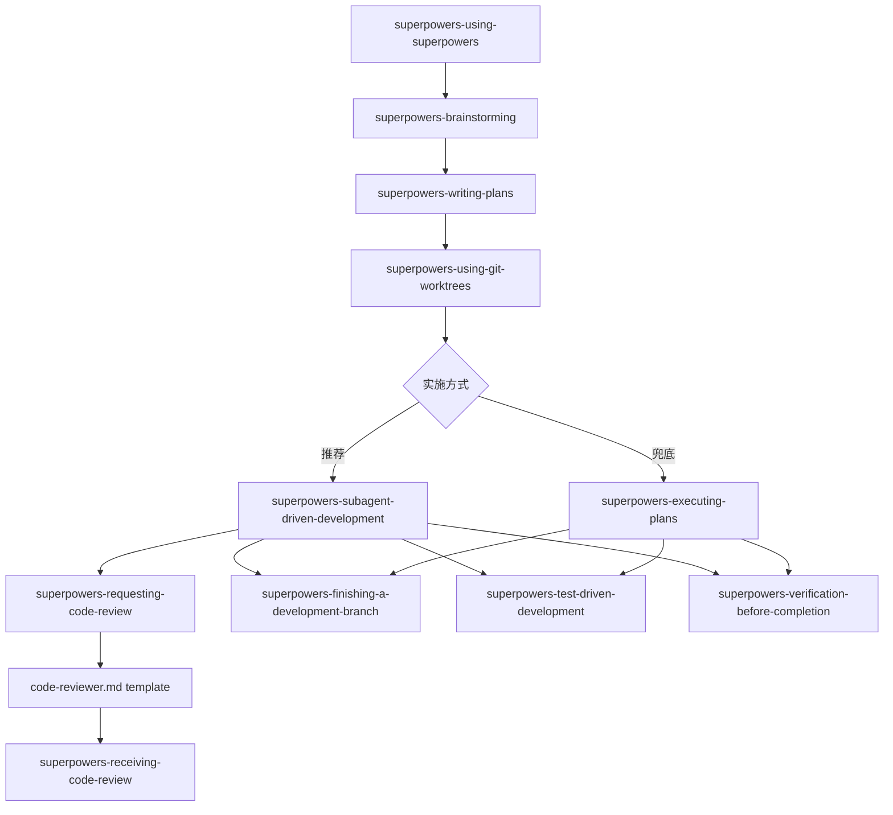

# Superpowers 工作流

当前命令包基于 [obra/superpowers](https://github.com/obra/superpowers) `v6.1.1` 同步，并按本仓库的 commands package 结构做了适配：

- 不再提供 command / agent 模板，只提供 skill 资源。
- skill 名称、目录与输出路径统一保留 `superpowers-` 前缀，适配当前 CLI 安装结构。
- 保留本地中文写作 skill `superpowers-writing-clearly-and-concisely`，不引入 upstream `writing-skills`。
- 本地不是完整 Codex plugin 包，因此不引入 upstream 的 `.codex-plugin`、marketplace manifest 和打包脚本；只同步 commands package 实际暴露的资源。

## 组件概览

`superpowers` 提供一组面向设计、计划、实现、调试、审查和收尾的工作流 skill：

- 总入口：`superpowers-using-superpowers`
- 设计阶段：`superpowers-brainstorming`
- 隔离工作区：`superpowers-using-git-worktrees`
- 计划阶段：`superpowers-writing-plans`
- 实施阶段：`superpowers-subagent-driven-development`、`superpowers-executing-plans`
- 审查阶段：`superpowers-requesting-code-review`、`superpowers-receiving-code-review`
- 质量与验证：`superpowers-test-driven-development`、`superpowers-verification-before-completion`
- 调试与并行：`superpowers-systematic-debugging`、`superpowers-dispatching-parallel-agents`
- 收尾：`superpowers-finishing-a-development-branch`
- 中文写作：`superpowers-writing-clearly-and-concisely`

## 主流程

## 关键配套文件

### Brainstorming
- `superpowers-brainstorming/spec-document-reviewer-prompt.md`：设计规范审查模板。
- `superpowers-brainstorming/visual-companion.md`：视觉脑暴浏览器伴侣指南。
- `superpowers-brainstorming/scripts/*`：视觉脑暴的本地服务脚本与页面模板。

### Writing Plans
- `superpowers-writing-plans/plan-document-reviewer-prompt.md`：实施计划文档审查模板。

### Subagent-Driven Development
- `superpowers-subagent-driven-development/implementer-prompt.md`
- `superpowers-subagent-driven-development/task-reviewer-prompt.md`
- `superpowers-subagent-driven-development/scripts/task-brief`
- `superpowers-subagent-driven-development/scripts/review-package`
- `superpowers-subagent-driven-development/scripts/sdd-workspace`

### Systematic Debugging
- `superpowers-systematic-debugging/*.md`：根因追踪、条件等待、分层防御、压力案例等参考资料。
- `superpowers-systematic-debugging/condition-based-waiting-example.ts`
- `superpowers-systematic-debugging/find-polluter.sh`

## 使用建议

1. 会话开始时优先用 `superpowers-using-superpowers` 判断该走哪条流程。
2. 有任何创造性工作，先走 `superpowers-brainstorming`，得到已确认的 spec 后进入 `superpowers-writing-plans`。
3. 执行计划前，用 `superpowers-using-git-worktrees` 确认隔离工作区；优先使用平台原生 worktree，必要时回退到 git worktree。
4. 有子代理能力时，默认优先 `superpowers-subagent-driven-development`；没有时再退回 `superpowers-executing-plans`。
5. 代码评审通过 `superpowers-requesting-code-review` 的 `code-reviewer.md` 模板 + `superpowers-receiving-code-review` 闭环处理；SDD 的每任务评审使用新的 `task-reviewer-prompt.md`。
6. 遇到复杂问题时优先启用 `superpowers-systematic-debugging`；面对多个独立问题时用 `superpowers-dispatching-parallel-agents`。
7. 宣称完成前，用 `superpowers-verification-before-completion` 先做新鲜验证；整个开发完成后再进入 `superpowers-finishing-a-development-branch`。
