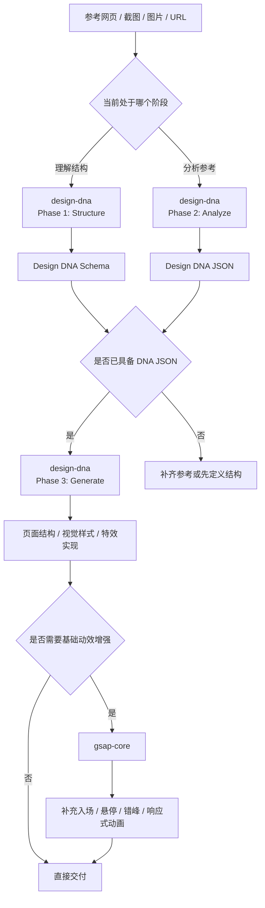

# Web-Design 工作流

当前命令包围绕网页视觉分析、设计迁移和基础动效实现组织，适合把“参考站点的视觉语言”拆成结构化设计描述，再落地为可交付页面，并在最后补充基础动画能力。

## 组件概览

`web-design` 当前由一条主设计链路和一条动效增强链路组成：

- 设计结构与分析：`design-dna`
- 设计生成：`design-dna`
- 结构参考：`design-dna/references/schema.md`
- 生成参考：`design-dna/references/generation-guide.md`
- 动效增强：`gsap-core`

## 主流程

## 阶段说明

### Phase 1：Structure

用于回答“这套设计结构长什么样”。

- 读取 `design-dna/references/schema.md`
- 输出完整字段结构
- 解释三个维度：`design_system`、`design_style`、`visual_effects`
- 适合在设计分析开始前统一口径

### Phase 2：Analyze

用于回答“这个参考设计到底有什么特征”。

- 输入可以是网页链接、截图、图片或多份参考
- 输出必须是完整的 Design DNA JSON
- 多份参考冲突时，要给主导模式和变体说明
- 适合做视觉迁移、风格归纳、设计资产沉淀

### Phase 3：Generate

用于回答“如何把这套设计语言应用到我的内容上”。

- 基于已有 DNA JSON 和业务内容生成页面
- 设计系统转成 CSS variables 或等价 token 配置
- 设计风格指导主观判断
- 视觉特效决定技术实现
- 默认输出自包含 HTML/CSS/JS；若在现有项目中落地，则遵循现有技术栈

### Motion Enhancement：GSAP Core

用于回答“页面结构已经稳定后，如何补上基础动画”。

- 适合入场、退场、悬停、错峰、响应式动画
- 不负责滚动联动、复杂时间轴和插件能力扩展
- 页面视觉和结构没定型前，不建议先堆动效

## 关键配套文件

### Design DNA

- `design-dna/SKILL.md`：三阶段主流程入口
- `design-dna/references/schema.md`：完整字段结构、字段说明与取值指导
- `design-dna/references/generation-guide.md`：从 DNA JSON 到页面实现的映射方式、技术选型和交付前检查

### GSAP Core

- `gsap-core/SKILL.md`：GSAP 核心 API 的使用边界、推荐场景、最佳实践与禁忌项

## 使用建议

1. 如果用户还没有清晰的视觉定义，先从 `design-dna` 的结构或分析阶段开始，不要直接跳到生成。
2. 只要目标是“复用参考站点的视觉语言”，就应该先产出一份完整的 Design DNA JSON，再进入生成阶段。
3. 涉及 Canvas、WebGL、Three.js、Lottie、粒子或滚动特效时，先参考 `generation-guide.md` 决定实现等级和回退策略。
4. 静态视觉、版式和组件关系稳定后，再使用 `gsap-core` 追加基础动画；否则容易在动效层面返工。
5. 只要涉及响应式动画或无障碍要求，务必在 GSAP 实现中处理 `prefers-reduced-motion`。
6. 若后续需要时间轴、滚动驱动或 GSAP 插件能力，应在 `gsap-core` 之外继续扩展对应技能，而不是把所有动效都塞进基础技能里。
