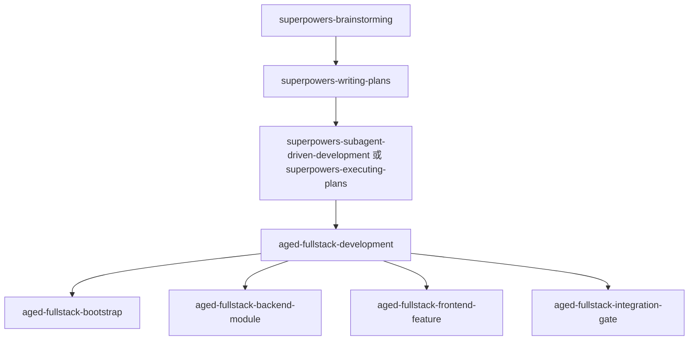

# Aged Fullstack 命令包实现计划

> **对于 agent 型执行者：** 必需子 skill：优先使用 `superpowers-subagent-driven-development`，否则使用 `superpowers-executing-plans` 逐任务实施本计划。所有步骤使用 `- [ ]` 复选框格式追踪。

**目标：** 在 `apps/spec-kit-app/public/commands-packages` 下新增 `aged-fullstack` 命令包，提供 5 个以 `aged-` 为前缀的全栈开发 skill，并明确它与 `superpowers` 的边界、`aged-*` 推荐规范，以及 `aged-fullstack-template` 的当前事实映射。

**架构：** 先用一个最小文件系统测试锁定新包的元信息和 skill 数量，再创建 `aged-fullstack` 目录、`_meta.json` 和 `workflow.md`。随后补两份共享参考文档，用来明确“模板当前事实”和“aged 推荐规范”，再分别实现 5 个 skill 文件，让主入口 skill 负责分流，其余 skill 分别负责起步、后端模块、前端功能和联调校验。最后运行 `spec-kit-app` 的测试，确认新包能被现有命令包广场正确读取。

**技术栈：** JSON、Markdown、Vitest、Next.js 文件树读取、命令包元信息约定

---

## 文件结构与职责

- 创建：`apps/spec-kit-app/public/commands-packages/aged-fullstack/_meta.json`
  - 定义包名、分类、5 个 skill 的元信息。
- 创建：`apps/spec-kit-app/public/commands-packages/aged-fullstack/workflow.md`
  - 说明包定位、skill 边界、与 `superpowers` 的关系、推荐调用顺序。
- 创建：`apps/spec-kit-app/public/commands-packages/aged-fullstack/skills/aged-fullstack-development/SKILL.md`
  - 主入口 skill，负责识别当前任务并分流。
- 创建：`apps/spec-kit-app/public/commands-packages/aged-fullstack/skills/aged-fullstack-development/references/template-facts.md`
  - 记录 `aged-fullstack-template` 当前事实。
- 创建：`apps/spec-kit-app/public/commands-packages/aged-fullstack/skills/aged-fullstack-development/references/recommended-rules.md`
  - 记录 `aged-*` 推荐规范。
- 创建：`apps/spec-kit-app/public/commands-packages/aged-fullstack/skills/aged-fullstack-bootstrap/SKILL.md`
  - 模板起步与自举验证。
- 创建：`apps/spec-kit-app/public/commands-packages/aged-fullstack/skills/aged-fullstack-backend-module/SKILL.md`
  - 后端 `module-first` 实现规则。
- 创建：`apps/spec-kit-app/public/commands-packages/aged-fullstack/skills/aged-fullstack-frontend-feature/SKILL.md`
  - 前端 `service + axios + interceptors` 实现规则。
- 创建：`apps/spec-kit-app/public/commands-packages/aged-fullstack/skills/aged-fullstack-integration-gate/SKILL.md`
  - 联调、自举校验与关键验证。
- 创建：`apps/spec-kit-app/test/aged-fullstack-package.test.ts`
  - 文件系统测试，确认命令包元信息和关键文件能被读取。

---

### 任务 1: 先锁定 aged-fullstack 包的可见性与元信息

**文件：**
- 创建：`apps/spec-kit-app/test/aged-fullstack-package.test.ts`
- 依赖：`apps/spec-kit-app/lib/commands-packages.ts`
- 目标目录：`apps/spec-kit-app/public/commands-packages/aged-fullstack`

- [ ] **步骤 1: 先写失败测试，锁定新包的基本结构**

创建 `apps/spec-kit-app/test/aged-fullstack-package.test.ts`：

```ts
import { describe, expect, it } from 'vitest';

import { getCommandsPackagesTree } from '@/lib/commands-packages';

function findDirectory(
  node: Awaited<ReturnType<typeof getCommandsPackagesTree>>,
  name: string,
): typeof node | undefined {
  if (node.name === name && node.type === 'directory') {
    return node;
  }

  for (const child of node.children) {
    if (child.type !== 'directory') {
      continue;
    }

    const match = findDirectory(child, name);
    if (match) {
      return match;
    }
  }

  return undefined;
}

describe('aged-fullstack package', () => {
  it('exposes package metadata, workflow and five aged-prefixed skills', async () => {
    const tree = await getCommandsPackagesTree();
    const packageDir = findDirectory(tree, 'aged-fullstack');
    const primarySkillIds =
      packageDir?.meta?.skills
        ?.map((skill) => skill.id)
        .filter((id) => !id.includes('.references.')) ?? [];

    expect(packageDir).toBeDefined();
    expect(packageDir?.meta).toMatchObject({
      package: 'aged-fullstack',
      category: '全栈开发',
    });

    expect(packageDir?.children.some((child) => child.type === 'file' && child.name === 'workflow.md')).toBe(true);
    expect(primarySkillIds).toEqual([
      'aged-fullstack-development',
      'aged-fullstack-bootstrap',
      'aged-fullstack-backend-module',
      'aged-fullstack-frontend-feature',
      'aged-fullstack-integration-gate',
    ]);
    expect(packageDir?.meta?.skills?.map((skill) => skill.id)).toContain(
      'aged-fullstack-development.references.template-facts',
    );
    expect(packageDir?.meta?.skills?.map((skill) => skill.id)).toContain(
      'aged-fullstack-development.references.recommended-rules',
    );
  });
});
```

- [ ] **步骤 2: 运行测试确认红灯**

运行：

```bash
cd apps/spec-kit-app
pnpm test -- test/aged-fullstack-package.test.ts
```

预期：
- 测试失败
- 失败点至少包含 `aged-fullstack` 目录不存在，或元信息为空

- [ ] **步骤 3: 创建包壳与 `_meta.json`**

创建目录：

```bash
mkdir -p \
  apps/spec-kit-app/public/commands-packages/aged-fullstack/skills/aged-fullstack-development/references \
  apps/spec-kit-app/public/commands-packages/aged-fullstack/skills/aged-fullstack-bootstrap \
  apps/spec-kit-app/public/commands-packages/aged-fullstack/skills/aged-fullstack-backend-module \
  apps/spec-kit-app/public/commands-packages/aged-fullstack/skills/aged-fullstack-frontend-feature \
  apps/spec-kit-app/public/commands-packages/aged-fullstack/skills/aged-fullstack-integration-gate
```

创建 `apps/spec-kit-app/public/commands-packages/aged-fullstack/_meta.json`：

```json
{
  "package": "aged-fullstack",
  "version": "1.0.0",
  "category": "全栈开发",
  "commands": [],
  "skills": [
    {
      "id": "aged-fullstack-development",
      "file": "skills/aged-fullstack-development/SKILL.md",
      "output": "aged-fullstack-development/SKILL.md",
      "description": "aged-* 项目的全栈开发主入口。识别当前任务属于起步、后端、前端还是联调，并将任务导向正确的 aged skill。"
    },
    {
      "id": "aged-fullstack-development.references.template-facts",
      "file": "skills/aged-fullstack-development/references/template-facts.md",
      "output": "aged-fullstack-development/references/template-facts.md",
      "description": "aged-fullstack-template 当前事实：目录、默认技术路径、脚本与关键验证命令。"
    },
    {
      "id": "aged-fullstack-development.references.recommended-rules",
      "file": "skills/aged-fullstack-development/references/recommended-rules.md",
      "output": "aged-fullstack-development/references/recommended-rules.md",
      "description": "aged-* 推荐规范：module-first、service 收口、稳定错误结构与最小验证要求。"
    },
    {
      "id": "aged-fullstack-bootstrap",
      "file": "skills/aged-fullstack-bootstrap/SKILL.md",
      "output": "aged-fullstack-bootstrap/SKILL.md",
      "description": "从 aged-fullstack-template 起步：init、环境准备、首次运行和自举验证。"
    },
    {
      "id": "aged-fullstack-backend-module",
      "file": "skills/aged-fullstack-backend-module/SKILL.md",
      "output": "aged-fullstack-backend-module/SKILL.md",
      "description": "按 module-first 方式实现 FastAPI 后端模块，默认走 router、service、Session 与 ORM model 路径。"
    },
    {
      "id": "aged-fullstack-frontend-feature",
      "file": "skills/aged-fullstack-frontend-feature/SKILL.md",
      "output": "aged-fullstack-frontend-feature/SKILL.md",
      "description": "按 aged 前端默认路径实现功能：service、axios、interceptors、hooks、pages 与 components。"
    },
    {
      "id": "aged-fullstack-integration-gate",
      "file": "skills/aged-fullstack-integration-gate/SKILL.md",
      "output": "aged-fullstack-integration-gate/SKILL.md",
      "description": "对齐前后端契约、错误结构与关键验证命令，在收尾前完成最小联调校验。"
    }
  ]
}
```

- [ ] **步骤 4: 重新运行测试验证包壳可见**

运行：

```bash
cd apps/spec-kit-app
pnpm test -- test/aged-fullstack-package.test.ts
```

预期：
- 测试通过
- 输出中显示 `1 passed`

---

### 任务 2: 写 workflow 与两份参考文档，明确边界和事实来源

**文件：**
- 创建：`apps/spec-kit-app/public/commands-packages/aged-fullstack/workflow.md`
- 创建：`apps/spec-kit-app/public/commands-packages/aged-fullstack/skills/aged-fullstack-development/references/template-facts.md`
- 创建：`apps/spec-kit-app/public/commands-packages/aged-fullstack/skills/aged-fullstack-development/references/recommended-rules.md`

- [ ] **步骤 1: 写 workflow，明确与 superpowers 的关系**

创建 `apps/spec-kit-app/public/commands-packages/aged-fullstack/workflow.md`：

```md
# Aged Fullstack 命令包工作流

本文档说明 `aged-fullstack` 命令包提供的 skill、适用场景，以及它与 `superpowers` 的职责边界。

## 概述

`aged-fullstack` 是 `aged-*` 项目的全栈领域包。它不接管总流程，而是默认挂在 `superpowers` 后面，负责模板起步、后端模块实现、前端功能实现，以及联调与关键校验。

它同时沉淀两类信息：

- `aged-fullstack-template` 当前已经存在的事实
- `aged-*` 项目推荐遵守的稳定规范

## 当前技能

- `aged-fullstack-development`
  - 作用：识别当前任务属于起步、后端、前端还是联调，并引导到正确的 aged skill
- `aged-fullstack-bootstrap`
  - 作用：从模板起步，执行初始化、环境准备、首次运行和自举验证
- `aged-fullstack-backend-module`
  - 作用：按 module-first 路径实现或修改 FastAPI 模块
- `aged-fullstack-frontend-feature`
  - 作用：按 service、axios、hooks、pages/components 的路径实现前端功能
- `aged-fullstack-integration-gate`
  - 作用：对齐前后端契约、错误结构与关键验证命令

## 与 superpowers 的边界

- `superpowers` 管总流程：设计、计划、执行、验证、收尾
- `aged-fullstack` 管领域规则：模板起步、模块边界、前端默认路径、联调与关键校验

如果需求仍在讨论，先使用 `superpowers-brainstorming`。
如果实施计划还没写，先使用 `superpowers-writing-plans`。
如果已经进入明确实现阶段，再进入 `aged-fullstack`。

## 主流程


```

- [ ] **步骤 2: 写模板事实参考文档**

创建 `apps/spec-kit-app/public/commands-packages/aged-fullstack/skills/aged-fullstack-development/references/template-facts.md`：

```md
# Template Facts

本文档只记录 `aged-fullstack-template` 当前已经存在的事实，不写抽象建议。

## 当前目录事实

- 后端目录：`backend/app/bootstrap`、`backend/app/modules`、`backend/app/platform`、`backend/app/shared`
- 前端目录：`frontend/src/components`、`frontend/src/hooks`、`frontend/src/pages`、`frontend/src/service`
- 共享元信息：`libs/template-meta`

## 当前后端事实

- 默认按 `modules/<name>` 组织业务代码
- `example` 模块当前默认路径为 `router.py -> service.py -> Session + ORM model`
- `repository.py` 当前不是模板默认必备层
- 数据库相关基础设施位于 `backend/app/platform/db`
- 迁移命令为 `pnpm db:migrate`

## 当前前端事实

- 请求能力统一收口到 `frontend/src/service`
- `frontend/src/service/core/client.ts` 使用 `axios`
- `frontend/src/service/core/interceptors.ts` 负责请求与响应拦截
- `frontend/src/service/core/errors.ts` 负责错误归一化
- 静态模板元信息由 `@aged-template/meta` 提供

## 当前模板脚本事实

- 初始化脚本：`scripts/init-project.mjs`
- 自举验证脚本：`scripts/verify-init-project.mjs`
- 全量测试：`pnpm test`
- 前端构建：`pnpm build:web`
```

- [ ] **步骤 3: 写 aged 推荐规范参考文档**

创建 `apps/spec-kit-app/public/commands-packages/aged-fullstack/skills/aged-fullstack-development/references/recommended-rules.md`：

```md
# Recommended Rules

本文档记录对 `aged-*` 项目推荐遵守的稳定规范，不要求模板外项目逐字照搬目录。

## 后端推荐规范

1. 优先采用 `module-first`
2. 默认路径优先是 `router.py -> service.py -> Session + ORM model`
3. 不要为了分层好看预先创建空 `repository.py`
4. `platform` 只放运行时基础设施，`shared` 只放轻量公共能力
5. 错误结构应稳定，不向客户端泄露原始 500 文本

## 前端推荐规范

1. 请求能力统一收口到 `service`
2. 不要额外并行创建新的 `lib` 请求入口
3. 默认采用统一的 `axios` client、拦截器和错误归一化
4. 页面与 hooks 只消费模块 service，不直接拼请求
5. 静态跨端元信息尽量单一来源

## 验证推荐规范

1. 起步项目时，优先补跑 `node ./scripts/verify-init-project.mjs`
2. 实现完成后，至少跑 `pnpm test`
3. 涉及前端交付时，补跑 `pnpm build:web`
4. 涉及迁移时，显式跑 `pnpm db:migrate`
```

- [ ] **步骤 4: 运行测试确认目录和元信息仍可读**

运行：

```bash
cd apps/spec-kit-app
pnpm test -- test/aged-fullstack-package.test.ts
```

预期：
- 测试继续通过
- 新增 reference 文件不会破坏命令包树读取

---

### 任务 3: 实现主入口 skill 和 4 个场景 skill

**文件：**
- 创建：`apps/spec-kit-app/public/commands-packages/aged-fullstack/skills/aged-fullstack-development/SKILL.md`
- 创建：`apps/spec-kit-app/public/commands-packages/aged-fullstack/skills/aged-fullstack-bootstrap/SKILL.md`
- 创建：`apps/spec-kit-app/public/commands-packages/aged-fullstack/skills/aged-fullstack-backend-module/SKILL.md`
- 创建：`apps/spec-kit-app/public/commands-packages/aged-fullstack/skills/aged-fullstack-frontend-feature/SKILL.md`
- 创建：`apps/spec-kit-app/public/commands-packages/aged-fullstack/skills/aged-fullstack-integration-gate/SKILL.md`

- [ ] **步骤 1: 实现主入口 skill**

创建 `apps/spec-kit-app/public/commands-packages/aged-fullstack/skills/aged-fullstack-development/SKILL.md`：

```md
---
name: aged-fullstack-development
description: aged-* 项目的全栈开发主入口。识别当前任务属于起步、后端、前端还是联调，并将任务导向正确的 aged skill。
---

# 选择正确的 aged 全栈 skill

这个 skill 只做领域分流，不接管总流程。

## 前置关系

- 如果需求和方案仍未定稿，先使用 `superpowers-brainstorming`
- 如果实施计划还未写好，先使用 `superpowers-writing-plans`
- 只有在任务已经进入明确执行阶段时，才进入本包

## 必读参考

1. 先读 `references/template-facts.md`
2. 再读 `references/recommended-rules.md`
3. 明确哪些是模板事实，哪些是 aged 推荐规范

## 分流规则

- 从模板起一个新项目、检查初始化链路、准备环境：
  使用 `aged-fullstack-bootstrap`
- 新增或修改 FastAPI 模块、处理 ORM、Session、migration：
  使用 `aged-fullstack-backend-module`
- 新增或修改前端页面、hooks、service、axios、错误结构：
  使用 `aged-fullstack-frontend-feature`
- 做接口接入、联调、关键验证、自举校验：
  使用 `aged-fullstack-integration-gate`

## 关键原则

- 不自己接管 brainstorming、planning、finish 流程
- 不把模板事实和推荐规范混成一句话
- 如果任务跨多个场景，先说明主次，再选择第一个进入的 skill
```

- [ ] **步骤 2: 实现 bootstrap skill**

创建 `apps/spec-kit-app/public/commands-packages/aged-fullstack/skills/aged-fullstack-bootstrap/SKILL.md`：

```md
---
name: aged-fullstack-bootstrap
description: 从 aged-fullstack-template 起步：init、环境准备、首次运行和自举验证。
---

# 从 aged-fullstack-template 起步

这个 skill 处理“如何正确从模板起项目”的问题。

## 适用场景

- 基于模板创建新的 `aged-*` 项目
- 检查模板派生链路是否还正常
- 首次准备依赖和运行环境

## 默认流程

1. 确认目标项目名符合 `aged-*`
2. 复制模板目录
3. 运行 `node ./scripts/init-project.mjs --name <project-name>`
4. 执行 `pnpm install`
5. 执行 `cd backend && uv sync`
6. 复制 `.env.example` 为 `.env`
7. 执行 `pnpm infra:up`
8. 执行 `pnpm db:migrate`
9. 执行 `node ./scripts/verify-init-project.mjs`
10. 需要联机验证时，再执行 `pnpm dev`

## 关键原则

- 初始化后优先跑自举验证，不直接假设模板可用
- 端口冲突时，优先在 `init-project` 阶段覆盖
- 模板脚本与 README 不一致时，以当前真实脚本为准
```

- [ ] **步骤 3: 实现 backend-module skill**

创建 `apps/spec-kit-app/public/commands-packages/aged-fullstack/skills/aged-fullstack-backend-module/SKILL.md`：

```md
---
name: aged-fullstack-backend-module
description: 按 module-first 方式实现 FastAPI 后端模块，默认走 router、service、Session 与 ORM model 路径。
---

# 按 aged 默认路径实现后端模块

这个 skill 用于在 `aged-*` 项目里按统一方式实现或修改 FastAPI 模块。

## 默认模块结构

```text
modules/<name>/
├─ router.py
├─ service.py
├─ schemas.py
├─ models.py
└─ repository.py   # optional
```

## 默认实现路径

`router.py -> service.py -> Session + ORM model`

## 实施规则

1. `router.py` 只处理 HTTP 层
2. `service.py` 是默认业务入口
3. `schemas.py` 放请求/响应 DTO
4. `models.py` 放 ORM model
5. `repository.py` 只在查询复杂或需要复用查询拼装时引入
6. `platform` 不承载业务代码
7. `shared` 不成为业务逻辑回收站

## 验证要求

- 相关 `pytest` 用例
- 必要时 `pnpm db:migrate`
- 涉及模板本身时，保持 `example` 路径与 README 一致
```

- [ ] **步骤 4: 实现 frontend-feature skill**

创建 `apps/spec-kit-app/public/commands-packages/aged-fullstack/skills/aged-fullstack-frontend-feature/SKILL.md`：

```md
---
name: aged-fullstack-frontend-feature
description: 按 aged 前端默认路径实现功能：service、axios、interceptors、hooks、pages 与 components。
---

# 按 aged 默认路径实现前端功能

这个 skill 用于在 `aged-*` 项目里按统一方式实现前端功能。

## 默认实现路径

1. 请求能力统一收口到 `service`
2. `service/core/client.ts` 负责 axios client
3. `service/core/interceptors.ts` 负责拦截器
4. `service/core/errors.ts` 负责统一错误结构
5. `service/modules/*` 负责模块 API
6. hooks、pages、components 只消费模块 service

## 实施规则

- 不新增平行的 `lib` 请求入口
- 不让页面直接拼接请求
- 静态元信息优先来自共享来源，例如 `libs/template-meta`
- 错误结构优先统一后再向页面暴露

## 验证要求

- 前端相关单测
- `pnpm test`
- `pnpm build:web`
```

- [ ] **步骤 5: 实现 integration-gate skill**

创建 `apps/spec-kit-app/public/commands-packages/aged-fullstack/skills/aged-fullstack-integration-gate/SKILL.md`：

```md
---
name: aged-fullstack-integration-gate
description: 对齐前后端契约、错误结构与关键验证命令，在收尾前完成最小联调校验。
---

# 做 aged 全栈联调与关键校验

这个 skill 用于在收尾前做最小联调校验。

## 适用场景

- 前端 service 接后端接口
- 对齐错误结构
- 跑关键验证命令
- 检查模板自举链路

## 检查项

1. 前端 service 的响应结构是否与后端一致
2. 错误结构是否稳定且能被前端统一解析
3. 涉及模板起步时，是否补跑 `node ./scripts/verify-init-project.mjs`
4. 是否至少运行：
   - `pnpm test`
   - `pnpm build:web`
5. 涉及迁移时，是否运行 `pnpm db:migrate`

## 输出要求

- 明确指出已验证项
- 明确指出未验证项
- 若契约和实现不一致，先暴露冲突，不静默绕过
```

- [ ] **步骤 6: 运行测试确认整个命令包可被读取**

运行：

```bash
cd apps/spec-kit-app
pnpm test -- test/aged-fullstack-package.test.ts
```

预期：
- 测试通过
- 输出显示 `1 passed`

---

### 任务 4: 做一轮整体校验并检查变更范围

**文件：**
- 修改：`apps/spec-kit-app/public/commands-packages/aged-fullstack/**`
- 创建：`apps/spec-kit-app/test/aged-fullstack-package.test.ts`

- [ ] **步骤 1: 运行 spec-kit-app 全量测试**

运行：

```bash
cd apps/spec-kit-app
pnpm test
```

预期：
- 所有测试通过
- 新增测试与现有 `commands-packages-explorer.test.tsx` 不冲突

- [ ] **步骤 2: 检查命令包树中的实际文件**

运行：

```bash
find apps/spec-kit-app/public/commands-packages/aged-fullstack -maxdepth 4 -type f | sort
```

预期至少包含：

```text
apps/spec-kit-app/public/commands-packages/aged-fullstack/_meta.json
apps/spec-kit-app/public/commands-packages/aged-fullstack/workflow.md
apps/spec-kit-app/public/commands-packages/aged-fullstack/skills/aged-fullstack-development/SKILL.md
apps/spec-kit-app/public/commands-packages/aged-fullstack/skills/aged-fullstack-development/references/template-facts.md
apps/spec-kit-app/public/commands-packages/aged-fullstack/skills/aged-fullstack-development/references/recommended-rules.md
apps/spec-kit-app/public/commands-packages/aged-fullstack/skills/aged-fullstack-bootstrap/SKILL.md
apps/spec-kit-app/public/commands-packages/aged-fullstack/skills/aged-fullstack-backend-module/SKILL.md
apps/spec-kit-app/public/commands-packages/aged-fullstack/skills/aged-fullstack-frontend-feature/SKILL.md
apps/spec-kit-app/public/commands-packages/aged-fullstack/skills/aged-fullstack-integration-gate/SKILL.md
```

- [ ] **步骤 3: 检查变更范围**

运行：

```bash
git status --short
git diff -- apps/spec-kit-app/public/commands-packages/aged-fullstack apps/spec-kit-app/test/aged-fullstack-package.test.ts
```

预期：
- 只出现计划内文件
- `_meta.json`、`workflow.md`、5 个 skill 与 2 个 reference 文档齐全
