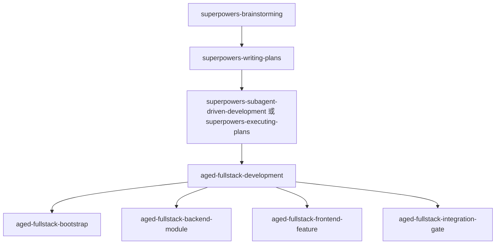

# Aged Fullstack 命令包设计

**目标**

新增一个 `aged-fullstack` 命令包，为 `aged-*` 项目的全栈开发提供领域级 skill。这个包不接管总流程，默认作为 `superpowers` 之后的领域执行层使用。它既要能覆盖 `aged-fullstack-template` 的当前落地方式，也要沉淀对 `aged-*` 项目普遍适用的推荐规范。

**设计结论**

`aged-fullstack` 不是新的总工作流框架，而是一个挂在 `superpowers` 后面的领域包。

默认关系如下：

1. 需求和方案未定时，先使用 `superpowers-brainstorming`
2. 进入实现前，先使用 `superpowers-writing-plans`
3. 真正进入实现时，再使用 `aged-fullstack` 里的具体 skill

## 包定位

### 1. 包名与命名前缀

- 命令包名：`aged-fullstack`
- skill 名称：全部使用 `aged-` 前缀

这样做有两个目的：

1. 让包名和 skill 名称保持一致
2. 让它一眼看出是 `aged-*` 领域能力，而不是通用工程能力

### 2. 适用范围

`aged-fullstack` 同时覆盖两层边界：

1. **`aged-*` 通用规则**
   面向所有 `aged-*` 项目，沉淀稳定的全栈开发约束。
2. **`aged-fullstack-template` 当前落地**
   说明这些规则在当前模板中的具体目录、脚本和示例文件。

这两层都要保留，但必须明确区分：

- 什么是模板当前事实
- 什么是 `aged-*` 推荐规范

## 包结构

建议包内提供 5 个 skill：

### 1. `aged-fullstack-development`

主入口 skill。

职责：

1. 判断当前任务属于哪一类全栈开发活动
2. 将任务引导到正确的子 skill
3. 明确本包依赖 `superpowers`，不自己接管总流程

它不直接大规模实施代码，只做领域分流。

### 2. `aged-fullstack-bootstrap`

起步 skill。

职责：

1. 从 `aged-fullstack-template` 派生项目
2. 执行 `init:project`
3. 准备 `.env`
4. 初始化本地依赖
5. 执行首次启动与自举验证

它解决“如何从模板正确起步”的问题。

### 3. `aged-fullstack-backend-module`

后端模块 skill。

职责：

1. 在 `FastAPI` 后端按 `module-first` 方式新增或修改模块
2. 约束默认路径为
   `router.py -> service.py -> Session + ORM model`
3. 明确 `repository.py` 是可选层，不是强制层
4. 要求模块边界清楚，不让 `platform` 和 `shared` 吞掉业务代码

它解决“如何在 `aged-*` 项目里按统一方式改后端”的问题。

### 4. `aged-fullstack-frontend-feature`

前端功能 skill。

职责：

1. 在前端按页面、hooks、组件、service 分工实现功能
2. 统一请求路径为 `service/core + service/modules`
3. 默认采用 `axios + interceptors + 统一错误结构`
4. 静态模板元信息优先来自 `libs/template-meta`

它解决“如何在 `aged-*` 项目里按统一方式改前端”的问题。

### 5. `aged-fullstack-integration-gate`

联调与校验 skill。

职责：

1. 对齐前后端接口契约和错误结构
2. 检查前端 service 与后端响应是否一致
3. 执行实现后的关键验证
4. 在起步或改造模板时，补跑自举链路验证

它不负责完整发布流程，但负责“进入收尾前”的最小领域校验。

## 与 `superpowers` 的关系

### 1. 分工边界

`superpowers` 负责总流程：

- 需求探索
- 写设计
- 写计划
- 执行计划
- 验证
- 收尾

`aged-fullstack` 负责领域规则：

- 模板起步方式
- 后端模块实现方式
- 前端功能实现方式
- 前后端联调方式
- 领域级校验要点

### 2. 默认调用顺序

推荐顺序如下：

也就是说，`aged-fullstack` 默认假设：

1. 方案已经定稿
2. 实施计划已经存在，或至少已进入明确执行阶段

## 模板事实与推荐规范

`aged-fullstack` 的文档和 skill 必须把下面两类信息分开写。

### 1. 模板当前事实

这些内容描述 `aged-fullstack-template` 当前已经存在的现实：

- 后端目录有 `bootstrap`、`modules`、`platform`、`shared`
- 后端 `example` 模块默认采用 ORM + request-scoped Session
- 前端请求统一收口到 `service`
- 前端默认使用 `axios`、拦截器和统一错误结构
- `libs/template-meta` 提供静态模板元信息
- `scripts/init-project.mjs` 和 `scripts/verify-init-project.mjs` 是模板自举链路的一部分

### 2. `aged-*` 推荐规范

这些内容描述对 `aged-*` 项目的建议，而不要求模板外项目一字不差照搬：

- 后端优先 `module-first`
- 默认不要预先创建空 `repository.py`
- 前端不要再额外造平行请求入口
- 通用错误结构应稳定、可推断
- 静态跨端元信息应尽量单一来源

## 每个 skill 的触发条件

### `aged-fullstack-development`

当用户表达的是“在 `aged-*` 项目里做全栈开发”，但还没有明确是前端、后端还是联调任务时触发。

### `aged-fullstack-bootstrap`

当用户要：

1. 从模板起一个新项目
2. 重新检查模板派生链路
3. 初始化环境并验证模板自举是否正常

时触发。

### `aged-fullstack-backend-module`

当用户要：

1. 新增 FastAPI 模块
2. 调整模块内的路由、service、schemas、models
3. 处理 ORM、Session、migration 相关默认路径

时触发。

### `aged-fullstack-frontend-feature`

当用户要：

1. 实现前端页面或功能
2. 改 service 层、hooks、页面与组件
3. 调整 axios client、拦截器、错误结构

时触发。

### `aged-fullstack-integration-gate`

当用户要：

1. 做前后端接口接入
2. 做联调
3. 做改动后的关键验证
4. 检查模板自举链路

时触发。

## 文档组织建议

这个命令包至少应包含：

1. `_meta.json`
2. `workflow.md`
3. `skills/aged-fullstack-development/SKILL.md`
4. `skills/aged-fullstack-bootstrap/SKILL.md`
5. `skills/aged-fullstack-backend-module/SKILL.md`
6. `skills/aged-fullstack-frontend-feature/SKILL.md`
7. `skills/aged-fullstack-integration-gate/SKILL.md`

如果某个 skill 需要补充稳定参考材料，可在其目录下增加：

- `references/*.md`
- `templates/*`

但不建议一开始就堆太多辅助文件。先把主 skill 写稳，再按需要补充。

## 范围边界

本包应该包含：

1. `aged-*` 项目的全栈领域规则
2. `aged-fullstack-template` 的当前事实映射
3. 起步、后端、前端、联调、校验这 5 类高频场景

本包不应该包含：

1. `superpowers` 那类总流程控制
2. 与 `aged-*` 无关的通用前端或后端开发规则
3. 具体业务域能力，如鉴权、用户体系、上传、RAG

## 决策摘要

1. 新包名定为 `aged-fullstack`
2. skill 全部使用 `aged-` 前缀
3. 包定位为领域层，不接管总流程
4. 默认依赖 `superpowers` 先完成设计与计划
5. 包内提供 5 个 skill：主入口、起步、后端模块、前端功能、联调校验
6. 文档必须明确区分模板事实与 `aged-*` 推荐规范
